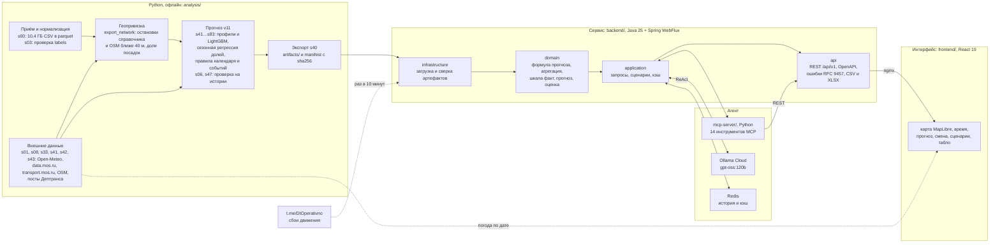

# Час пик: прогноз загрузки трамвайных маршрутов

Решение для трека «ИИ-прогноз загрузки трамвайных маршрутов» хакатона Московского транспорта 2026. Прогнозируем почасовые посадки на 10 трамвайных маршрутах Москвы на ноябрь-декабрь 2025 по валидациям за январь-октябрь 2025.

Постановка, критерии и сроки лежат в [docs/](docs/README.md). Анализ данных, внешние факторы и эксперименты описаны в [docs/analysis/README.md](docs/analysis/README.md). Область применимости модели: [docs/applicability.md](docs/applicability.md), ограничения и план развития: [docs/limitations_and_roadmap.md](docs/limitations_and_roadmap.md).

## Быстрый старт

Нужен только Docker. Из корня репозитория:

```bash
docker compose up -d --build
```

После сборки (у нас без кеша 3 минуты) интерфейс открывается на http://localhost:8080, вход: логин `dispatcher`, пароль `chaspik`. Документация API: http://localhost:8080/swagger-ui.html, кнопка «Authorize» принимает тот же логин и пароль. Помощнику диспетчера нужен ключ `LLM_API_KEY` в `.env` (см. `.env.example`), без него работает всё остальное.

| Критерий | Где смотреть |
|---|---|
| Качество прогноза | сабмиты в [forecasts/](forecasts/), все оценённые файлы со скорами и SHA-256 в [реестре](forecasts/leaderboard_results.json), как собран финальный прогноз - [ниже](#финальный-прогноз-v11) |
| Внешние данные | ссылки, лицензии и способ выгрузки - [external/README.md](external/README.md), эффект каждого источника - [docs/analysis/README.md](docs/analysis/README.md#3-внешние-факторы), в интерфейсе вкладка «Факторы» |
| Область применимости и поправки | [docs/applicability.md](docs/applicability.md), ползунки с живым пересчётом - вкладка «Сценарий», точность - вкладка «Точность» |
| Архитектура и производительность | [схема](#архитектура) ниже, замеры k6 - [backend/README.md](backend/README.md): одна реплика на 2 vCPU держит 4000 запросов/с при p95 < 1 мс |
| Функциональность | горизонты сутки, неделя, месяц и год; маршрут, остановка, участок и сеть; карта; выгрузка CSV и XLSX кнопкой в верхней строке |
| Польза для диспетчера | [раздел ниже](#польза-для-диспетчера), вкладка «Смена» и режим табло |
| Дополнительные возможности | [список ниже](#дополнительные-возможности) |

## Что уже сделано

- Сырые валидации (62.4 млн строк) переведены в parquet. Целевая величина воспроизводится из сырья точно во всех 72 960 ячейках.
- Подключены и проверены внешние источники: производственный календарь, почасовая погода Open-Meteo, помесячная статистика пассажиропотока и загруженность дорог data.mos.ru, события сети по постам Дептранса, геометрия маршрутов из OpenStreetMap. Ссылки и способ выгрузки: [external/README.md](external/README.md).
- На первом этапе бэктест на 4 фолдах сравнивал baseline организаторов (0.469), медианные профили (до 0.845 в среднем, 0.904 на октябре), LightGBM и foundation-модели Chronos-2, t0-beta, TimesFM 3.0. Лучше всего на том этапе (0.870) работала смесь профиля с городским сезонным уровнем из data.mos.ru и Chronos-2 + t0-beta на дневных суммах.
- Финальная модель — [v11](forecasts/submission_seasonal_daily_v11.csv), скор **0.90741**: усиленная сезонная модель почасовых долей и распределение объёма между днями с сохранением месячных сумм по маршрутам и типам дня. Прирост **+0.00010** к v10 (0.90731). [Проверки и воспроизведение v11](docs/research/seasonal_daily_v11_2026-09-26.md), [передача ML команде](docs/ml_handoff.md), [реестр оценённых сабмитов](forecasts/leaderboard_results.json).
- Эксперимент [v8](forecasts/submission_joint_day_v8.csv): обученный на Mac JointDayNet + Chronos-2, дневные суммы v7 сохранены. На шести периодах разработки средний прирост +0.001782; **скор платформы 0.90555**, на 0.00015 ниже v7. Лучшее решение сохраняем. [Обучение, проверки и воспроизведение](docs/research/local_neural_v8_2026-09-26.md).
- [v9](forecasts/submission_architecture_v9.csv): графовая модель режимов + STL/ETS и согласование групповых сумм. **Скор 0.90543**, на 0.00027 ниже v7; исторический прирост не подтвердился. [Архитектура, все проверки и ограничения](docs/research/architecture_v9_2026-09-26.md).
- Сервис на Java 25 и Spring Boot 4.1 (WebFlux) отдаёт прогноз из `artifacts/` по маршруту, остановке, участку и сети на горизонтах день, месяц и год, пересчитывает его по ползункам и событиям, строит кадры тепловой карты и выгружает CSV и XLSX. Одна реплика на 2 vCPU держит 4000 запросов/с при p95 < 1 мс. Запуск, API и замеры: [backend/README.md](backend/README.md).
- Интерфейс диспетчера на React: карта Москвы с тепловой картой посадок по часам, вагонами по расписанию transport.mos.ru (на крупном плане объёмными), метро, 3D-домами и осадками там, где они идут. Любая дата с января 2025 по октябрь 2026 с пометкой «факт», «прогноз» или «оценка», проигрывание времени до ×900, поездка трамвая с посадками на каждой остановке, прогноз по сети, маршруту, остановке и участку, сравнение двух дат на одном графике, советы по интервалам, ползунки сценариев, внешние факторы и качество модели на одном экране. Выгрузка в CSV и XLSX с выбором объекта, периода и шага, фильтр маршрутов и спутниковая подложка. Подробности: [frontend/README.md](frontend/README.md).
- Вкладка «Смена» для диспетчера: сводка смены одной кнопкой, оповещения на завтра по маршруту или участку, узкие места на неделю вперёд и калькулятор выпуска вагонов. Режим табло на большой экран диспетчерской.
- Сбои из оперативного канала Дептранса превращаются в события сценария: сервис сам читает t.me/DtOperativno, находит пары «задерживаются трамваи» и «движение восстановлено» и считает потерю посадок по часам. Сбой можно примерить на любой день прогноза.
- После встречи с организаторами 26.09: вход в сервис по логину и паролю; горизонт «неделя» и пиковый час каждого дня у недели и месяца; маршрут по станциям и дням одной клавишей (S) и номера маршрутов с клавиатуры; сплит и панели виджетов, которые диспетчер расставляет сам; валидации вне часов работы маршрутов (проверки оборудования) отброшены из факта; пропуски в данных 2025 года найдены, у каждого названа причина по постам Дептранса и восстановлены посадки по прошлым неделям; №5 по умолчанию скрыт. Подробности: [frontend/README.md](frontend/README.md), [backend/README.md](backend/README.md#вход).
- План и факт по прошедшим дням: на 1 февраля - 31 октября 2025 сервис хранит прогноз, который диспетчер получил бы вечером накануне, и показывает его пунктиром рядом с фактом. Точность плана 0.8912 по часам и 0.9249 по суткам. Как собран план: [analysis/export_plan.py](analysis/export_plan.py).
- Тур по разделам при первом входе: 11 шагов с подсветкой блоков, повторить можно кнопкой со знаком вопроса в верхней строке.
- Помощник диспетчера: ReAct-агент на Java в плашке верхней строки, вопросы текстом или голосом. Модель `gpt-oss:120b` через Ollama Cloud, 14 инструментов MCP-сервера на Python (SDK `mcp` 2.2.0), история диалога и кэш ответов в Redis. Агент считает, показывает на карте и открывает нужную панель. Подробности: [mcp-server/README.md](mcp-server/README.md), [backend/README.md](backend/README.md#агент).
- Презентация для жюри: [presentation/chaspik.html](presentation/chaspik.html), один HTML-файл на 10 слайдов, открывается без сети. Сервис показан на рисованном макете, по которому ходит курсор. Сборка и данные: [presentation/README.md](presentation/README.md).

Сервис по умолчанию отдаёт прогноз финальной модели v11 (0.90741) до ячейки: формула профиля домножается на поправку до v11 в каждой ячейке, поэтому ползунки и события работают поверх v11. Как это устроено: [artifacts/README.md](artifacts/README.md).

## Структура

```
analysis/           скрипты анализа, экспорта и экспериментов; ML-раунды s41…s83
artifacts/          артефакты модели для сервиса: компоненты прогноза, ползунки, остановки, сеть (s40)
backend/            сервис прогноза на Java: API, сценарии, выгрузка, тесты
frontend/           интерфейс диспетчера на React: карта, время, сценарии, факторы
mcp-server/         MCP-сервер на Python для агента: инструменты поверх API и команды интерфейсу
presentation/       презентация на Remotion: один HTML-файл, исходники и скрипты данных
dataset/            данные организаторов
  README.md         описание датасета
  labels/           почасовые посадки route;date;hour;boardings
  spravochniki/     справочники маршрутов и остановок (xlsx)
  test_submission.csv   шаблон сабмита с baseline
docs/               постановка, критерии, анализ, обзоры
  analysis/         отчёт, графики (figures/) и таблицы результатов (tables/)
  research/         обзоры моделей, похожих решений, внешних источников, событий сети
external/           внешние данные: погода, календарь, data.mos.ru, OSM, события
forecasts/          прогнозы на ноябрь-декабрь в формате сабмита и их коэффициенты
deploy/             nginx перед репликами сервиса и сценарий нагрузочного замера k6
tests/              эталонные тесты артефактов на Python
```

## Архитектура

Модель считается на Python офлайн и отдаёт сервису готовые артефакты. Сервис на Java модель не запускает: при старте он сверяет артефакты с `manifest.json` по sha256 и пересчитывает прогноз по той же формуле, что и экспорт. Если результат разойдётся с эталоном, сервис не стартует.



Границы слоёв проверяет `ArchitectureTest`: domain не зависит от Spring, Reactor, Jackson и других слоёв, application вызывается только из api, к api и infrastructure не обращается ни один слой. Подробности по сервису и замеры нагрузки: [backend/README.md](backend/README.md).

## Польза для диспетчера

Прогноз нужен, чтобы заранее решить, сколько вагонов выпускать на линию и в какие часы. Пример из интерфейса: маршрут 17, пятница 14 ноября 2025. В 8:00 прогноз 5 349 посадок при интервале 7 минут по расписанию transport.mos.ru — это около 312 посадок на рейс. «Витязь-М» везёт 185 человек при 5 чел/м² ([pk-ts.org](https://pk-ts.org/produkciya/vityaz-m/)).

- Карточка «Посадок на рейс» делит прогноз маршрута на число рейсов по расписанию и подсвечивает часы выше порога. При пороге 185 сервис советует интервал 4 минуты вместо 6 в 7-10 ч и 4 минуты вместо 7 в 16-20 ч. Порог диспетчер задаёт ползунком.
- Часы, где на рейс меньше 15 посадок, отмечены отдельно. Там интервал можно увеличить, а вагоны перевести на пиковые часы.
- Перекрытие, мероприятие или снегопад задаются событием на вкладке «Сценарий», прогноз по сети и по дням пересчитывается сразу.
- Участок между двумя остановками показывает, где именно на маршруте растёт поток, и выгружается в CSV или XLSX отдельно.

Вкладка «Смена» собирает это в рабочие инструменты:

- Сводка смены на выбранный день: погода, посадки и пиковый час, разница с тем же днём неделей раньше, три самых загруженных маршрута, тесные часы с советом по интервалу, события дня. Кнопка копирует текст для рабочего чата, вторая просит агента пересказать его.
- Оповещения: подписка на маршрут или участок с порогом посадок на рейс. Если завтра поток выше порога, подписка краснеет, а на колокольчике в верхней строке появляется число.
- Узкие места на 7 дней: маршрут, день и часы, где на рейс входит больше людей, чем помещается в вагон, от самых острых, с остановкой, где входят больше всего. На неделе 15-21 ноября это 64 отрезка, самый острый - маршрут 17 в 7-10 ч 19 ноября, до 319 посадок на рейс.
- Калькулятор выпуска: интервал в выбранные часы превращается в число вагонов на линии, посадки на рейс и вагоно-часы. Рядом те же числа по расписанию.
- Табло на большой экран: крупные числа по одному маршруту, маршруты сменяются сами каждые 8 секунд, внизу все маршруты сразу, бегущая строка с оповещениями и сбоями.

Ограничение: в валидациях виден только вход, выходов нет. Посадки на рейс - это поток входящих, а не наполнение салона. Поэтому совет по интервалу - повод проверить наполнение на загруженном участке, а не готовое расписание.

## Дополнительные возможности

Сверх обязательного (горизонты день, месяц и год, агрегация по маршруту, остановке, участку и интервалу, карта, выгрузка CSV и XLSX, внешние факторы):

| Возможность | Где в интерфейсе |
|---|---|
| Сводка смены, оповещения на завтра с порогом посадок на рейс, узкие места на неделю, калькулятор выпуска вагонов | вкладка «Смена», колокольчик в верхней строке |
| Табло на большой экран диспетчерской | кнопка с монитором в верхней строке |
| Помощник диспетчера: вопросы текстом или голосом, агент считает, показывает на карте и открывает панель | плашка «Спросить» в верхней строке, нужен ключ `LLM_API_KEY` |
| Сбои из канала «Дептранс. Оперативно» как события сценария, их можно примерить на любой день | вкладка «Сценарий» |
| План и факт по прошедшим дням | график на вкладке «Прогноз» для дат до 31 октября 2025 |
| Сравнение двух дат на одном графике | «Сравнить с» под графиком прогноза |
| Горизонт «неделя», пиковый час каждого дня, самые напряжённые дни месяца | вкладка «Прогноз» |
| Помесячная оценка на январь-октябрь 2026 года с коридором | любая дата 2026 года |
| Поездка трамвая с посадками на каждой остановке | «Пустить трамвай» в карточке маршрута |
| Маршрут по станциям и дням: матрица остановок против дней недели или месяца | кнопка в карточке маршрута или клавиша S |
| Пропуски в данных 2025 года с причиной по постам Дептранса и восстановленными посадками | вкладка «Точность» |
| Погода на карте там, где идут осадки, свет по времени суток, метро, объёмные дома, спутник | кнопки слоёв над картой |
| Раскладки «сплит» и «панели» с виджетами, которые диспетчер расставляет сам | значки в верхней строке или клавиша V |
| Горячие клавиши: номер маршрута цифрами, день и час стрелками | список в настройках по клавише ? |
| Вход по логину и паролю, Swagger с кнопкой «Authorize» | экран входа, /swagger-ui.html |
| Тур по разделам при первом входе | кнопка со знаком вопроса в верхней строке |

## Запуск

Нужен [uv](https://docs.astral.sh/uv/). Сырые `dataset/train.csv` (8.2 ГБ) и `dataset/test.csv` (2.2 ГБ) в репозиторий не входят. Их нужно скачать архивом `dataset.zip` по ссылке https://disk.yandex.ru/d/DiFwlfMOauxjBg и положить в `dataset/`.

```bash
uv sync                  # анализ и классические модели
uv sync --extra fm       # + torch 2.14 (CUDA 13.0), Chronos-2, TimesFM 3.0, t0-beta
cd analysis
uv run python s00_prepare_parquet.py
uv run python s10_forecast.py
```

Полный порядок запуска всех шагов приведён в [docs/analysis/README.md](docs/analysis/README.md#7-как-воспроизвести).

### Финальный прогноз v11

Готовый [CSV](forecasts/submission_seasonal_daily_v11.csv) переобучения не требует: SHA-256 и параметры лежат в [JSON рядом](forecasts/submission_seasonal_daily_v11.json), сервис сверяет с ним каждую ячейку. v11 собирается цепочкой раундов. Каждый раунд читает прогноз предыдущего и сам строит свои кэши в `data/`, сырые 10 ГБ не нужны: раунды берут метки из `dataset/labels/`.

| Шаг | Скрипты `analysis/` | Результат в `forecasts/` | Скор | Расхождение на Python 3.14 |
|---|---|---|---:|---:|
| Адаптивные профили, LightGBM, сбои Дептранса | s42-s46 | `submission_kaggle_v1_weather.csv` | 0.90236 | 0.15 % |
| Единый ансамбль | s47 | `submission_kaggle_unified_v2.csv` | 0.90358 | 0.14 % |
| Дневной уровень, маршрут 5 | s52-s59 | `submission_daily_route5_v4.csv` | 0.90418 | 0.15 % |
| Почасовые доли, городской трамвай | s62-s64 | `submission_shape_facts_v6.csv` | 0.90553 | 0.10 % |
| Форма суток, данные для следующих раундов | s66 | `submission_shape50_v7.csv` | 0.90570 | 0.04 % |
| Сезонная модель почасовых долей | s80, s81 | `submission_seasonal_v10.csv` | 0.90731 | 0.05 % |
| Распределение объёма между днями | s82, s83 | `submission_seasonal_daily_v11.csv` | 0.90741 | 0.04 % |

Раунды запускаются в общем окружении uv на Python 3.14: `uv sync --extra fm` (torch нужен шагам s80-s83), на Windows с режимом UTF-8 `PYTHONUTF8=1`. Последняя колонка - проверка 26.09.2026 на чистом клоне: каждый шаг запускался от закоммиченного входа, и его файл отличается от оценённого на столько процентов суммы модулей. Шаги v6-v11 сохраняют суммы входа, у них общая сумма совпала точно, у v1-v4 сдвиг не больше 0.04 %. Новые LightGBM и numpy дают немного другие числа, поэтому s47, s59 и s64 на актуальных версиях останавливаются на своих проверках точного совпадения с оценёнными файлами. Побайтно эти файлы повторяются только в окружении, где раунды считались: Python 3.9 и `analysis/requirements-round4-py39.txt`. Команды, тесты и проверки каждого шага описаны в отчётах раундов, ссылки собраны в [docs/ml_handoff.md](docs/ml_handoff.md). Пересчёт v11 под суммы проб уровня на табло собирает `analysis/s84_block_probes.py apply` в окружении uv, тест `tests/test_block_probes.py` пересобирает загруженный файл из журнала проб ([отчёт](docs/research/block_probes_2026-09-26.md)).

### Сервис

Сервис с интерфейсом, MCP-сервером и Redis запускается из корня одной командой, сырые данные и Python ему не нужны:

```bash
cp .env.example .env            # для агента впишите LLM_API_KEY Ollama Cloud; без ключа работает всё, кроме агента
docker compose up -d --build    # интерфейс http://localhost:8080, документация API: /swagger-ui.html
```

Вход в интерфейс: логин `dispatcher`, пароль `chaspik`. Свои учётные записи задаёт `AUTH_USERS` в `.env`, подробности в [backend/README.md](backend/README.md#вход).

Порт интерфейса меняется переменной `API_PORT`, например `API_PORT=8090 docker compose up -d`.

Проверка на чистом клоне 26.09.2026 (Windows 11, Docker 28, Intel Core Ultra 5 125H, 32 ГБ): сборка всех образов без кеша слоёв заняла 155 с, запуск 26 с. Контейнер api после старта занимает 474 МБ из лимита 2 ГБ, прогноз сервиса совпадает с v11 по сумме сети за ноябрь-декабрь до посадки.
