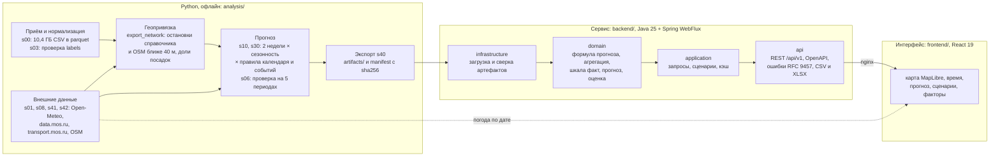

# Прогноз загрузки трамвайных маршрутов

Решение для трека «ИИ-прогноз загрузки трамвайных маршрутов» хакатона Московского транспорта 2026. Прогнозируем почасовые посадки на 10 трамвайных маршрутах Москвы на ноябрь-декабрь 2025 по валидациям за январь-октябрь 2025.

Постановка, критерии и сроки лежат в [docs/](docs/README.md). Анализ данных, внешние факторы и эксперименты описаны в [docs/analysis/README.md](docs/analysis/README.md).

## Что уже сделано

- Сырые валидации (62.4 млн строк) переведены в parquet. Целевая величина воспроизводится из сырья точно во всех 72 960 ячейках.
- Подключены и проверены внешние источники: производственный календарь, почасовая погода Open-Meteo, помесячная статистика пассажиропотока data.mos.ru, события сети по постам Дептранса, геометрия маршрутов из OpenStreetMap.
- Бэктест на 4 фолдах сравнивает baseline организаторов (0.469), медианные профили (до 0.845 в среднем, 0.904 на октябре), LightGBM и foundation-модели Chronos-2, t0-beta, TimesFM 3.0. Лучше всего (0.870) работает смесь профиля с городским сезонным уровнем из data.mos.ru и Chronos-2 + t0-beta на дневных суммах.
- Прогноз на ноябрь-декабрь собран в нескольких вариантах для проверки на лидерборде. Лучший - `forecasts/submission_ex_ante_route5.csv`, скор **0.89950** (порог максимального балла 0.88), коэффициенты каждого варианта лежат рядом в JSON.
- Сервис на Java 25 и Spring Boot 4.1 (WebFlux) отдаёт этот прогноз по маршруту, остановке, участку и сети на горизонтах день, месяц и год, пересчитывает его по ползункам и событиям, строит кадры тепловой карты и выгружает CSV и XLSX. Одна реплика на 2 vCPU держит 4000 запросов/с при p95 < 1 мс. Запуск, API и замеры: [backend/README.md](backend/README.md).
- Интерфейс диспетчера на React: карта Москвы с тепловой картой посадок по часам, вагонами по расписанию transport.mos.ru (на крупном плане объёмными), метро, 3D-домами и осадками там, где они идут. Любая дата с января 2025 по октябрь 2026 с пометкой «факт», «прогноз» или «оценка», проигрывание времени до ×3600, поездка трамвая с посадками на каждой остановке, прогноз по сети, маршруту, остановке и участку, советы по интервалам, ползунки сценариев, внешние факторы и качество модели на одном экране. Подробности: [frontend/README.md](frontend/README.md).

## Структура

```
analysis/           скрипты анализа и экспериментов, запускаются по номерам s00…s40
artifacts/          артефакты модели для сервиса: компоненты прогноза, ползунки, остановки, сеть (s40)
backend/            сервис прогноза на Java: API, сценарии, выгрузка, тесты
frontend/           интерфейс диспетчера на React: карта, время, сценарии, факторы
dataset/            данные организаторов
  README.md         описание датасета
  labels/           почасовые посадки route;date;hour;boardings
  spravochniki/     справочники маршрутов и остановок (xlsx)
  test_submission.csv   шаблон сабмита с baseline
docs/               постановка, критерии, анализ, обзоры
  analysis/         отчёт, графики (figures/) и таблицы результатов (tables/)
  research/         обзоры моделей, похожих решений, внешних источников, событий сети
external/           внешние данные: погода, календарь, data.mos.ru, OSM, события
forecasts/          прогнозы на ноябрь-декабрь в формате сабмита и их коэффициенты
deploy/             nginx перед репликами сервиса и сценарий нагрузочного замера k6
tests/              эталонные тесты артефактов на Python
```

## Архитектура

Модель считается на Python офлайн и отдаёт сервису готовые артефакты. Сервис на Java модель не запускает: при старте он сверяет артефакты с `manifest.json` по sha256 и пересчитывает прогноз по той же формуле, что и экспорт. Если результат разойдётся с эталоном, сервис не стартует.



Границы слоёв проверяет `ArchitectureTest`: domain не зависит от Spring, Reactor, Jackson и других слоёв, application вызывается только из api, к api и infrastructure не обращается ни один слой. Подробности по сервису и замеры нагрузки: [backend/README.md](backend/README.md).

## Польза для диспетчера

Прогноз нужен, чтобы заранее решить, сколько вагонов выпускать на линию и в какие часы. Пример из интерфейса: маршрут 17, пятница 14 ноября 2025. В 8:00 прогноз 5 390 посадок при интервале 7 минут по расписанию transport.mos.ru, это около 314 посадок на рейс. «Витязь-М» везёт 185 человек при 5 чел/м² ([pk-ts.org](https://pk-ts.org/produkciya/vityaz-m/)).

- Карточка «Посадок на рейс» делит прогноз маршрута на число рейсов по расписанию и подсвечивает часы выше порога. При пороге 185 сервис советует интервал 4 минуты вместо 6 в 7-10 ч и 4 минуты вместо 7 в 16-20 ч. Порог диспетчер задаёт ползунком.
- Часы, где на рейс меньше 15 посадок, отмечены отдельно. Там интервал можно увеличить, а вагоны перевести на пиковые часы.
- Перекрытие, мероприятие или снегопад задаются событием на вкладке «Сценарий», прогноз по сети и по дням пересчитывается сразу.
- Участок между двумя остановками показывает, где именно на маршруте растёт поток, и выгружается в CSV или XLSX отдельно.

Ограничение: в валидациях виден только вход, выходов нет. Посадки на рейс - это поток входящих, а не наполнение салона. Поэтому совет по интервалу - повод проверить наполнение на загруженном участке, а не готовое расписание.

## Запуск

Нужен [uv](https://docs.astral.sh/uv/). Сырые `dataset/train.csv` (8.2 ГБ) и `dataset/test.csv` (2.2 ГБ) в репозиторий не входят. Их нужно скачать архивом `dataset.zip` по ссылке https://disk.yandex.ru/d/DiFwlfMOauxjBg и положить в `dataset/`.

```bash
uv sync                  # анализ и классические модели
uv sync --extra fm       # + torch 2.14 (CUDA 13.0), Chronos-2, TimesFM 3.0, t0-beta
cd analysis
uv run python s00_prepare_parquet.py
uv run python s10_forecast.py
```

Полный порядок запуска всех шагов приведён в [docs/analysis/README.md](docs/analysis/README.md#7-как-воспроизвести).

Сервис с интерфейсом запускается из корня одной командой, сырые данные и Python ему не нужны:

```bash
docker compose up -d --build    # интерфейс http://localhost:8080, документация API: /swagger-ui.html
```
