# Анализ данных, внешние факторы и эксперименты

Отчёт отвечает на три вопроса. Что на самом деле лежит в 62 млн валидаций? Какие внешние факторы двигают посадки и насколько? Какой подход прогнозирует ноябрь-декабрь лучше? Все цифры получены скриптами из `analysis/`, порядок запуска в конце. Графики лежат в [figures/](figures/), таблицы с полными результатами в [tables/](tables/). Обзоры моделей, похожих решений и внешних источников вынесены в [../research/](../research/).

## Коротко

- Целевая величина воспроизводится из сырья точно: `count(validation_result = 1)` по маршруту и часу `tran_ts` совпадает с labels во всех 72 960 ячейках (59 667 191 посадка). Дедупликации нет.
- Лучший результат на лидерборде **0.89950** у `forecasts/submission_ex_ante_route5.csv`: профиль за 2 недели, уровень по городскому трамваю прошлых лет, события и календарь, маршрут 5. Смесь с маршрутом 5 дала 0.89574, без него 0.89169, оба варианта выше порога 0.88 (максимум по критерию 1). Пробы на эталоне показали, что возврат выходных маршрутов 7 и 50 даёт +1.16 п.п., календарные правила +0.14 п.п., а погодная поправка -0.26 п.п. Финальный сабмит `forecasts/submission_final.csv` собран из подтвердившихся частей, без погоды. Честный вариант только с тем, что знали на 31.10, без foundation-моделей дал 0.89541.
- Маршрута 5 в истории нет: одна неуспешная валидация 29.10. Он запущен 16.12.2025, и лидерборд подтвердил, что в эталоне он есть: прогноз около 5 тыс. посадок в будни (по новости о 160 тыс. поездок за первый месяц) улучшает скор на 0.4 п.п.
- Baseline организаторов - это среднее по ненулевым строкам labels за январь-октябрь в трёх блоках по 8 часов. На любом месяце истории он даёт 0.42-0.50, то есть их «≈ 0.48» на ноябре-декабре ведёт себя как обычный месяц.
- Уровень маршрута ломают перекрытия, а не спрос. Недельные изменения посадок и числа вагонов на линии коррелируют на 0.66-0.90 у маршрутов 12, 28, 7, 11. С 06.09 маршрут 50 по выходным не ходил, с 15.11 вернулся. Этого нет в данных, это внешний факт из постов Дептранса.
- Потолок почасового прогноза около 0.92 WAPE-score. Даже если дневные суммы по маршрутам известны точно, форма суток даёт остаток 8 пунктов.
- Лучший одиночный подход на стабильном октябре - медианный профиль «маршрут × тип дня × час» за 4 недели: 0.904. Почасовые foundation-модели дают в среднем по 4 фолдам 0.848-0.857 против 0.845 у профиля, весь их выигрыш идёт от уровня, и на 61 дне они уводят его вниз.
- Во втором раунде (п. 4.7) лучшим стал подход, где уровень задают внешние данные: смесь «профиль × городской сезонный уровень из data.mos.ru» и «Chronos-2 + t0-beta на дневных суммах × форма суток профиля» даёт 0.870 в среднем по фолдам (профиль 0.845). Городской множитель почти совпадает с оптимальным на каждом фолде, так что эффект внешнего источника подтверждён на метрике.
- Подтверждённые внешние эффекты: календарь +4.9 п.п. WAPE-score на фолде с майскими праздниками (в среднем по 4 фолдам +1.05, на летнем фолде без него на 0.7 п.п. лучше), осадки -0.74 % посадок на мм. Эффект мороза (-1.8 % на градус ниже -10 °C) оценён всего по двум дням, 16-17.02, и надёжным не считается. Школьные каникулы на суточные суммы значимо не влияют (p = 0.52). Загруженность дорог (data.mos.ru 62525) задаёт уровень месяца: +10.5 % посадок трамвая Москвы на балл (p = 0.0001), на бэктесте +0.75 п.п. к профилю и +0.41 п.п. к сезонности прошлых лет (п. 3.3).

## 1. Данные и их качество

`s00_prepare_parquet.py` переводит 10.4 ГБ CSV в один parquet (1.9 ГБ, zstd). Все поля читаются строками и приводятся через `TRY_CAST`, чтобы битые значения становились NULL и их можно было посчитать. Параллельный CSV-ридер DuckDB на этих файлах падает на кавычках, поэтому чтение однопоточное (133 с). Потерь нет: 62 443 497 строк = 62 443 499 строк в файлах минус два заголовка.

| Проверка | Результат |
|---|---|
| Строк train / test | 49 051 926 / 13 391 571 |
| Успешные валидации (`validation_result = 1`) | 95.56 %. Отказы: код 90 2.25 %, 33 0.71 %, 31 0.65 %, 10 0.61 %, остальные меньше 0.06 % |
| `tran_type_id` | 52 (основной проход) 74.4 %, 60 10.6 %, 75 9.8 % (успешных 77 %), 65 4.7 % |
| `input_date_time` | 21 270 значений вне 2025 года, как и предупреждали организаторы; не используем |
| Хвосты в чужой месяц | 550 строк train за 01.09 и 615 строк test за 01.11, это ночные часы после полуночи |
| Полные дубли | 0. Пара (`tran_no`, `device_no`) не уникальна (522 865 повторов): счётчик транзакций на устройстве перезапускается |
| Повтор той же карты в том же вагоне за 60 с | 0.28 % успешных валидаций, в target они входят |
| Нет `garage_number` у успешных | 413 827 (0.7 %) |
| `place_id` | Код депо вагона, а не маршрута и не остановки. В июле 339 тыс. посадок маршрута 50 пришли с `place_id` депо Русакова, когда 50-й был объединён с 13-м |

Сверка labels ([s03_raw_quality.py](../../analysis/s03_raw_quality.py)): агрегат из сырья совпал с labels в 100 % ячеек. Значит, эталон на ноябрь-декабрь строится тем же правилом, и любые валидации, которые в эти месяцы не пройдут успешно (бесплатный проезд 31.12 после 20:00), в него не попадут.

## 2. Структура целевой величины

### 2.1 Уровни и перекрытия

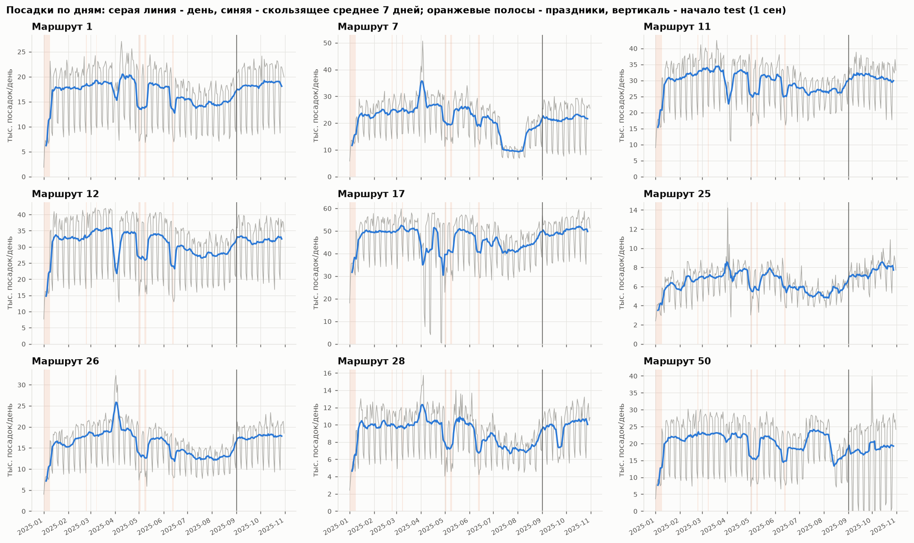

Главное на этом графике - провалы и всплески, которые не объясняются календарём. Их 58 маршруто-дней, отклоняющихся от медианы того же типа дня в окне ±21 день больше чем на 35 % ([tables/anomalous_days.csv](tables/anomalous_days.csv)). Почти каждый нашёлся в постах Дептранса ([../research/routes_events_2025.md](../research/routes_events_2025.md)):

- маршрут 7 с 10.07 по 10.08 ходил только до Сокольников: будни 10.6 тыс. против 28 тыс.;
- маршрут 50 в то же время был объединён с 13-м (+10 % к весне);
- маршрут 17 по выходным 05-06.04 и 12-13.04 был укорочен, а 26-27.04 не ходил вообще (673 и 323 посадки);
- с 06.09 по 09.11 маршрут 50 по выходным не работал (от 0 до 2.7 тыс. посадок вместо 8-16 тыс. в августе), а 7-й ходил по выходным только до Каланчёвской;
- у маршрута 28 провал 22-24.09 до 0.55 от нормы из-за ремонта на Живописной;
- неделя 31.03-06.04: у 7, 25, 26, 28 рост на 15-70 %, у 1, 11, 12, 17 падение на 20-40 %. В новостях причины нет, похоже на сбой привязки валидаторов. При обучении такие дни лучше исключать.

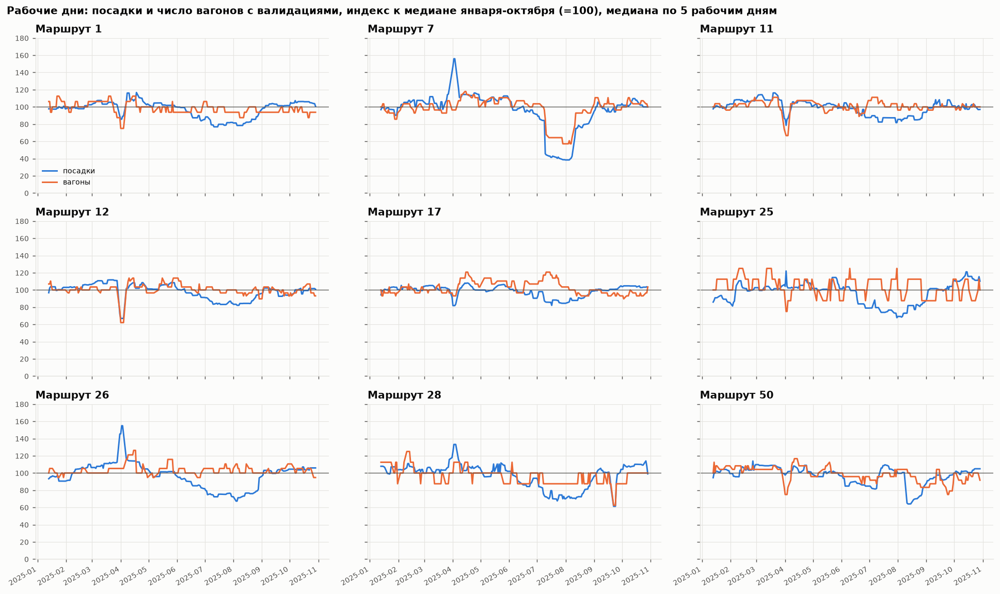

Индекс посадок и числа вагонов с валидациями на одной оси показывает, что уровень маршрута задаёт выпуск. Корреляция недельных изменений: маршрут 12 0.90, 28 0.72, 7 0.70, 11 0.66, 1 0.49 ([tables/supply_demand_corr.csv](tables/supply_demand_corr.csv)). Для прогноза отсюда следует, что будущие перекрытия невозможно предсказать по истории, их можно только взять из внешних источников.

### 2.2 Неделя и сутки

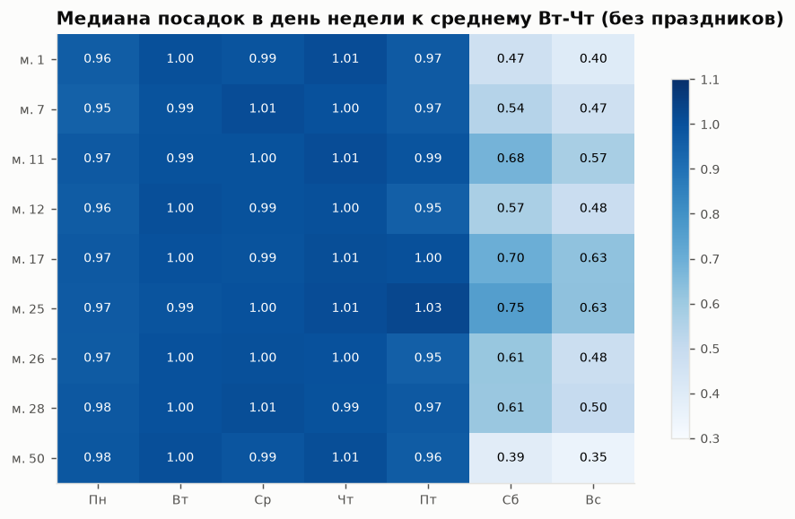

Будни ровные: понедельник и пятница 0.95-0.98 от вторника-четверга, у маршрута 25 пятница 1.03. Выходные сильно разные по маршрутам. Суббота 0.39 (маршрут 50, ездят на работу) и 0.75 (маршрут 25, парк «Сокольники» и ВДНХ). Воскресенье от 0.35 до 0.63.

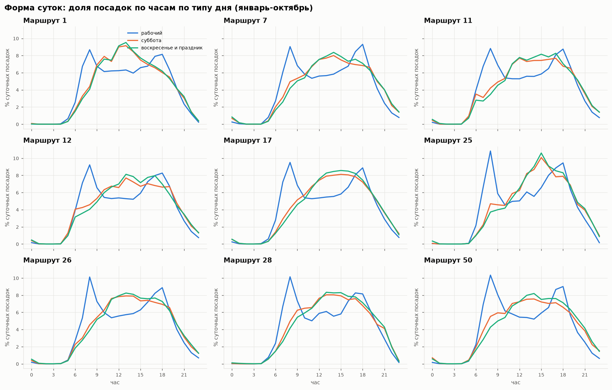

В будни два пика, 8:00 и 17-18:00, у маршрута 7 вечерний пик выше утреннего. В выходные один плоский горб 12-17 ч. Праздники по форме совпадают с воскресеньем. Часы 7-19 дают 86.7 % всех посадок, часы 0-5 только 0.8 % ([tables/hour_mass.csv](tables/hour_mass.csv)). Поэтому WAPE решается дневными и пиковыми часами, а ночь можно брать из профиля.

### 2.3 Праздники

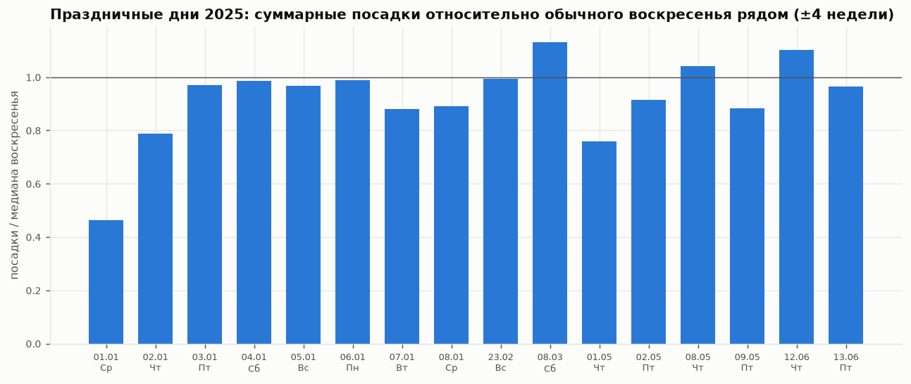

Праздничный день в среднем близок к воскресенью: 0.88-1.13 от медианы воскресений в окне ±4 недели. Исключения - 1 января (0.46), 2 января (0.79) и 1 мая (0.76). Для 3-4 ноября берём воскресный профиль с множителем 0.95. Рабочих суббот в истории нет ни одной, поэтому 1 ноября придётся задавать правилом.

### 2.4 Сезонность и кто делает лето

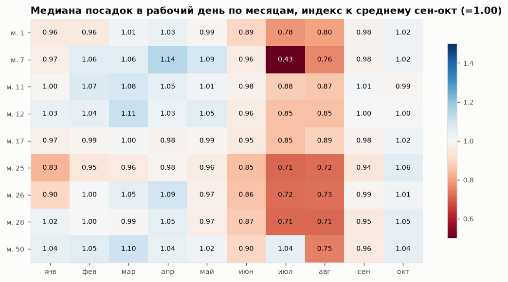

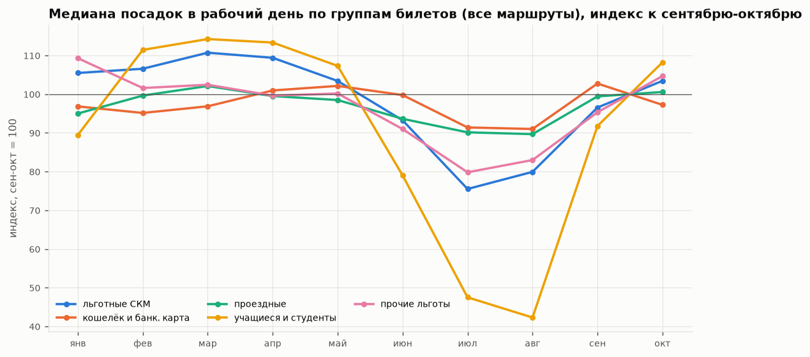

Летний провал почти целиком делают две группы. Учащиеся и студенты (СКМО, студенческие и школьные проездные) в июле-августе падают до 42-48 % от осеннего уровня. Льготники с СКМ (33.6 % всех посадок) проседают до 75-80 %. Кошелёк, банковские карты и обычные проездные теряют летом только 9-10 %. Январь-апрель по всем группам близки к сентябрю-октябрю или выше. Значит, зима не должна давать провала, похожего на летний.

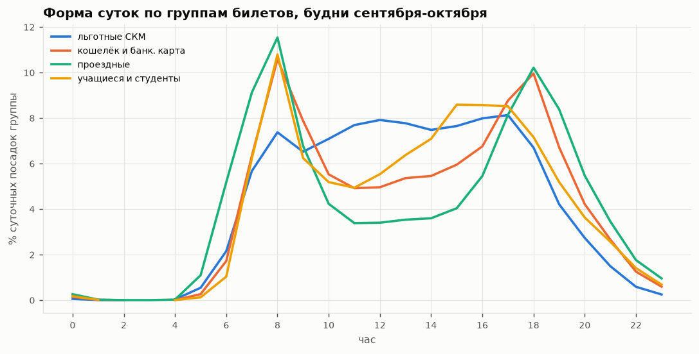

У льготников нет утреннего пика, их поездки растянуты с 9 до 17 ч, у учащихся второй горб 15-17 ч. Смена доли групп меняет и уровень, и форму суток. В сентябре-октябре в среднем за день было 236 тыс. успешных валидаций по всем маршрутам от 167 тыс. уникальных карт, 1.41 поездки на карту.

## 3. Внешние факторы

По критерию 2 балл дают за источник, у которого есть ссылка и подтверждённый эффект. Ниже все источники, которые мы подключили или проверили. Выгрузка воспроизводится скриптами `s01_fetch_weather.py` и `s08_fetch_external.py`, файлы и лицензии перечислены в [external/README.md](../../external/README.md).

| Фактор | Источник и способ получения | Эффект на наших данных | Как используем |
|---|---|---|---|
| Производственный календарь, переносы, рабочая суббота, сокращённые дни | [Постановление № 1335](https://www.consultant.ru/law/ref/calendar/proizvodstvennye/2025/), API [isdayoff.ru](https://isdayoff.ru/api/getdata?year=2025&cc=ru&pre=1), пакет `holidays` 0.105 | Без календаря профиль на фолде «май-июнь» даёт 0.767, с календарём 0.816 (+4.9 п.п.). На фолдах без праздников разницы нет, на летнем без календаря лучше на 0.7 п.п., в среднем по 4 фолдам +1.05 п.п. Праздник ≈ 0.95 воскресенья. Сокращённый день +5.2 %, будний день перед 3+ выходными -5.6 % (оба p < 0.001, но по 3-4 дням) | Тип дня в профиле, правила для 01.11, 03-04.11, 29-31.12 |
| Погода по часам | [Open-Meteo Historical API](https://open-meteo.com/en/docs/historical-weather-api) (IFS 9 км / ERA5, CC BY 4.0), сверка со станцией ВДНХ: MAE температуры 0.71 °C, корреляция суточных осадков 0.95 | Осадки -0.74 % на мм за день (p < 0.001), час с осадками больше 2 мм -10 %, мороз ниже -10 °C -1.8 % на градус (p = 0.018, но таких дней в истории только два, 16-17.02). Снег на мм воды вредит слабее дождя | Множители по дневным и часовым осадкам и морозу на фактической погоде ноября-декабря 2025 |
| Школьные каникулы Москвы | Графики школ на mskobr.ru ([пример](https://1517.mskobr.ru/edu-news/11020)) | -0.6 %, p = 0.52: на суточные суммы эффекта нет. Неделя 27-31.10 в будни на 2 % ниже предыдущей | Не используем как множитель, описан как проверенный и отвергнутый |
| Городская сезонность пассажиропотока | [data.mos.ru, набор 62521](https://data.mos.ru/opendata/7704786030-mesyachniy-passajiropotok-po-vsem-vidam-obshchestvennogo-transporta-v-gorode-moskve), помесячно по видам транспорта с 2019 г. | Наши 9 маршрутов повторяют городской трамвай: corr 0.97, амплитуда 0.83 от городской (рис. 12). Корреляцию в основном даёт летний провал: без июня-августа она 0.58 | Уровень ноября 1.015 и декабря 1.02 к октябрю |
| События сети: перекрытия, запуски, бесплатный проезд | Telegram-канал [«Дептранс. Оперативно»](https://t.me/DtOperativno) (5273 поста разобраны), mos.ru, sobyanin.ru; каталог в [external/events_2025.csv](../../external/events_2025.csv) | Объясняют почти все аномалии истории (п. 2.1). 01.01.2025 в часы бесплатного проезда 0, 0, 0, 0, 5, 25 валидаций при обычных около 450 | Выходные 7 и 50 с 15.11, Т1 с 12.11, маршрут 5 с 16.12, ноль после 20:00 31.12 |
| Геометрия маршрутов и остановок | [OpenStreetMap через Overpass API](https://wiki.openstreetmap.org/wiki/Overpass_API) (ODbL), справочник организаторов | Трассы и остановки по всем 10 маршрутам (справочник покрывает только 1, 5, 7, 11, 12) | Карта (рис. 16), основа геопривязки для сервиса |
| Световой день | Open-Meteo `daily=sunrise,sunset,daylight_duration` | Меняется плавно и после удаления локального уровня не отделяется от сезона | Выгружен, отдельно не используем |
| Дорожный трафик | [data.mos.ru, набор 62525](https://data.mos.ru/opendata/62525): балл и процент загруженности дорог по месяцам с 2020 года (Дептранс), выгрузка без ключа; баллы и скорость потока ЦОДД из постов [«Дептранс. Оперативно»](https://t.me/s/DtOperativno), 150 дней за 2025 год | +10.5 % посадок трамвая Москвы на балл загруженности за месяц (p = 0.0001), сверх сезонности +4.2 % (p = 0.0004). Дневные баллы ЦОДД своего эффекта не дают (п. 3.3) | Уровень ноября-декабря в варианте `submission_traffic.csv`, ползунок веса трафика в уровне |

### 3.1 Погода

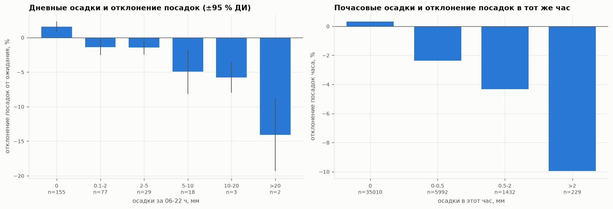

Эффект оценивается на остатке дня после удаления локального уровня. Локальный уровень - медиана того же маршрута и типа дня в окне ±21 день без самого дня. Дни с отклонением больше 35 % (перекрытия) выброшены, стандартные ошибки HAC ([s05_weather_effect.py](../../analysis/s05_weather_effect.py)).

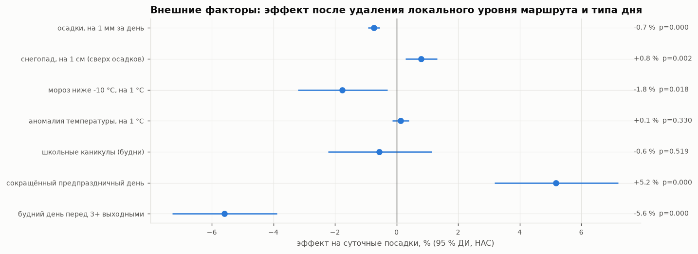

Погода даёт единицы процентов, как и в литературе по холодному климату ([../research/similar_solutions.md](../research/similar_solutions.md), п. 2.3). В WAPE это небольшой выигрыш. Если убрать ошибку уровня (оракул по маршруту), поправка на погоду добавляет +0.2 и +0.4 п.п. на весеннем и летнем фолдах и -0.1 на осенних. Без оракула знак зависит от того, в какую сторону ошибся уровень, поэтому по сырому WAPE-score погоду оценивать нельзя.

### 3.2 Городская сезонность и уровень ноября-декабря

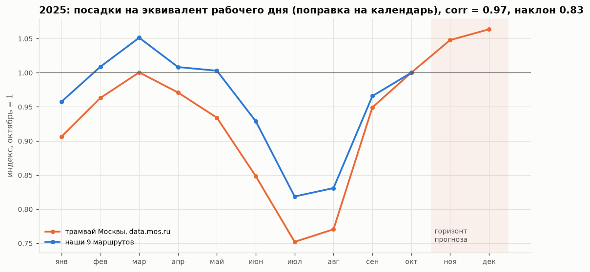

Для ноября и декабря в истории нет прошлого года, поэтому уровень берём из городской статистики. Сырые отношения «ноябрь к октябрю» вводят в заблуждение. В ноябре 2025 было 11 нерабочих дней против 8 в октябре, поэтому пересчитываем месяц в «эквивалент рабочего дня» с весами суббота 0.61, воскресенье 0.50, праздник 0.45 (измерены на наших данных).

| Трамвай Москвы | Ноя/Окт в сутки | Дек/Окт в сутки | Ноя/Окт с поправкой на календарь | Дек/Окт с поправкой на календарь |
|---|---|---|---|---|
| 2022 | 1.024 | 1.015 | 1.016 | 0.997 |
| 2023 | 1.052 | 1.026 | 1.059 | 1.041 |
| 2024 | 0.983 | 1.056 | 1.008 | 1.104 |
| 2025 | 0.980 | 1.042 | 1.048 | 1.064 |
| 2025 без чистого прироста от Т1 (40 тыс. поездок в будни) | | | 1.013 | 1.010 |

С амплитудой наших маршрутов 0.83 от городской получаем ноябрь 1.011-1.023 и декабрь 1.008-1.039 к октябрю. В прогнозе стоят 1.015 и 1.02. Это самое неуверенное место прогноза. Рядом с оптимумом ошибка уровня в 3 % стоит 0.3-0.5 п.п. WAPE-score: на октябрьском фолде 3.4 % дают 0.45 п.п. (tables/exp2_level_shape.csv). Дорогими бывают только большие промахи: 8-19 % на переходах сезонов стоили 1.5-5.8 п.п. Способ проверить уровень на лидерборде описан ниже в п. 5.

### 3.3 Трафик

Почасового архива пробок за 2025 год в открытом доступе нет, но есть два ряда загруженности дорог. Дептранс публикует на data.mos.ru помесячный балл и процент загруженности ([набор 62525](https://data.mos.ru/opendata/62525)) с июня 2020 года. ЦОДД несколько раз в день сообщает балл и среднюю скорость потока в канале [«Дептранс. Оперативно»](https://t.me/s/DtOperativno): за 2025 год балл есть в 150 днях, чаще в будни вечером. Оба ряда выгружает [s33_fetch_traffic.py](../../analysis/s33_fetch_traffic.py), проверяет [s34_traffic_probe.py](../../analysis/s34_traffic_probe.py).

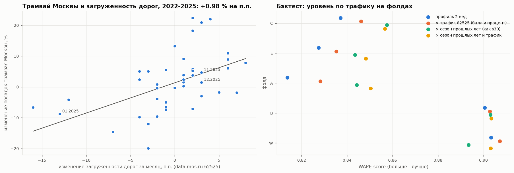

**Загруженность задаёт уровень месяца.** В 2022-2025 годах рост загруженности на 1 балл за месяц сопровождается ростом посадок трамвая Москвы на эквивалент рабочего дня на 10.5 % (95 % ДИ 5.2-15.9 %, p = 0.0001), на 1 п.п. загруженности - на 0.98 % (0.51-1.45 %). Связь держится и сверх обычной сезонности: с эффектами года и месяца +4.2 % на балл (p = 0.0004). У наших маршрутов за февраль-октябрь 2025 знак тот же, +1.65 % на п.п., но 8 месячных изменений мало для значимости (p = 0.17). Полная таблица: [tables/exp_traffic_effect.csv](tables/exp_traffic_effect.csv).

**Дневные баллы ЦОДД своего эффекта не дают.** Балл дня связан с посадками маршрута в тот же будний день (+0.66 % на балл, p = 0.04). Если вычесть медиану балла за соседние ±15 дней, эффект пропадает: +0.10 %, p = 0.76. Пробки показывают, сколько ездит город в этот период, а дневные колебания пробок посадки не двигают.

**На бэктесте уровень по трафику лучше профиля на всех пяти фолдах** ([tables/exp_traffic_backtest.csv](tables/exp_traffic_backtest.csv)). Множитель месяца горизонта равен exp(γ·ΔT), где ΔT - загруженность месяца минус загруженность месяца отсечки. γ оценён по трамваю Москвы только на месяцах до отсечки, балл и процент усреднены в логарифме.

| Вариант | C | E | A | B | W | Среднее | При выровненном уровне | Смещение суммы, % |
|---|---|---|---|---|---|---|---|---|
| профиль 2 нед | 0.8371 | 0.8275 | 0.8137 | 0.9005 | 0.9033 | 0.8564 | 0.8728 | -12.6…+9.2 |
| × трафик (62525, балл и процент) | 0.8461 | 0.8353 | 0.8283 | 0.9029 | 0.9072 | 0.8639 | 0.8732 | -9.8…+7.3 |
| × сезон прошлых лет (схема s30) | 0.8575 | 0.8435 | 0.8442 | 0.9030 | 0.8934 | 0.8683 | 0.8740 | -4.1…+5.7 |
| × сезон прошлых лет и трафик | 0.8567 | 0.8482 | 0.8503 | 0.9034 | 0.9032 | 0.8724 | 0.8738 | -2.5…+3.2 |
| × городской трамвай 2025 (схема s18) | 0.8586 | 0.8468 | 0.8245 | 0.9008 | 0.9021 | 0.8665 | 0.8740 | -3.0…+10.6 |
| × городской трамвай 2025 и трафик | 0.8566 | 0.8477 | 0.8517 | 0.9032 | 0.9058 | 0.8730 | 0.8740 | -0.3…+2.6 |
| × дневной балл ЦОДД | 0.8378 | 0.8278 | 0.8166 | 0.9000 | 0.9033 | 0.8571 | 0.8730 | -12.1…+9.2 |

Трафик работает через уровень: при выровненном уровне он меняет скор не больше чем на 0.04 п.п. Сам по себе он добавляет к профилю 0.75 п.п., к сезонности прошлых лет 0.41 п.п., к городскому пассажиропотоку 0.65 п.п. В смесях выигрыш есть на четырёх фолдах из пяти, на весеннем фолде C скор ниже на 0.08 и 0.20 п.п. В смеси с сезонностью разброс смещения суммы по фолдам сужается с -4.1…+5.7 % до -2.5…+3.2 %.

В ноябре-декабре 2025 загруженность выросла с 2.2 балла и 19 % в октябре до 2.8 балла и 22-25 %. По трафику это множители 1.048 и 1.064 к октябрю. Вариант `forecasts/submission_traffic.csv` ([s35](../../analysis/s35_traffic_forecast.py)) = s32 (0.89950 на лидерборде), где уровень ноября и декабря усреднён между сезонностью прошлых лет и трафиком: 1.025 и 1.049 вместо 1.003 и 1.034, посадок на 2.2 % и 1.4 % больше. На лидерборде он не проверялся. Данные о загруженности за ноябрь-декабрь вышли после 31.10, в честный вариант s30 они не входят.

## 4. Эксперименты

### 4.1 Как проверяем

Бэктест повторяет задачу: обучаемся на всём до точки отсечки и прогнозируем 1-2 месяца по часам без данных внутри горизонта ([s06_backtest.py](../../analysis/s06_backtest.py)). Одного окна мало, потому что каждое искажено своим. Поэтому фолдов четыре:

| Фолд | Обучение | Прогноз | Чем особенный |
|---|---|---|---|
| C | до 30.04 | май-июнь, 61 день | майские и июньские праздники, начало летнего спада |
| E | до 30.06 | июль-август, 62 дня | лето, перекрытие маршрута 7 |
| A | до 31.08 | сентябрь-октябрь, 61 день | разбиение организаторов, скачок уровня после лета |
| B | до 30.09 | октябрь, 31 день | стабильный режим, ближе всего к ноябрю |

Метрика - WAPE-score на всей сетке 10 маршрутов × часы. Маршрут 5 во всех фолдах нулевой.

### 4.2 Классические модели

| Модель | C | E | A | B | Среднее |
|---|---|---|---|---|---|
| baseline организаторов | 0.473 | 0.450 | 0.477 | 0.476 | 0.469 |
| seasonal naive (последняя неделя) | 0.793 | 0.814 | 0.823 | 0.886 | 0.829 |
| профиль 2 нед, медиана | 0.837 | 0.828 | 0.814 | 0.901 | **0.845** |
| профиль 4 нед, медиана | 0.816 | 0.810 | 0.794 | **0.904** | 0.831 |
| профиль 8 нед, медиана | 0.855 | 0.777 | 0.755 | 0.869 | 0.814 |
| профиль 4 нед, среднее вместо медианы | 0.826 | 0.811 | 0.790 | 0.902 | 0.832 |
| профиль 4 нед, отдельно Пн-Пт | 0.815 | 0.809 | 0.794 | 0.904 | 0.830 |
| профиль 4 нед без календаря | 0.767 | 0.817 | 0.794 | 0.904 | 0.820 |
| профиль 4 нед + погода | 0.825 | 0.827 | 0.788 | 0.899 | 0.835 |
| LightGBM L1 на посадках | 0.826 | 0.822 | 0.786 | 0.885 | 0.830 |
| LightGBM-поправка к профилю | 0.785 | 0.833 | 0.771 | 0.882 | 0.818 |

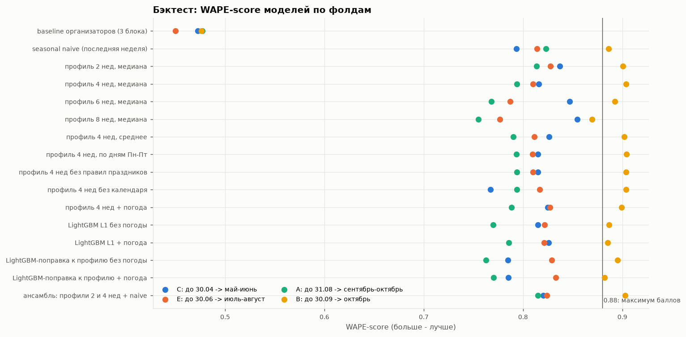

Длина окна профиля работает как ручка «свежесть против шума». На стабильном октябре 4 недели лучше двух, на переходах сезонов выигрывает короткое окно. LightGBM с признаками от точки прогноза (профили за 2, 4 и 8 недель, календарь и погода цели, горизонт) профиль не обыграл ни в абсолютной постановке, ни как поправка к профилю. Деревья не экстраполируют уровень, а поправки, выученные на весне и лете, на осень не переносятся.

### 4.3 Где сидит ошибка

Прогноз масштабируем под фактическую сумму: сначала по маршруту за весь горизонт, потом по маршруту за каждый день. Разница показывает, сколько ошибки дают уровень и форма ([tables/backtest_oracle_decomposition.csv](tables/backtest_oracle_decomposition.csv)).

| Профиль 4 нед | C | E | A | B |
|---|---|---|---|---|
| как есть | 0.816 | 0.810 | 0.794 | 0.904 |
| уровень маршрута за горизонт известен | 0.807 | 0.857 | 0.860 | 0.911 |
| сумма маршрута за каждый день известна | 0.907 | 0.908 | 0.895 | 0.922 |

Потолок почасового прогноза около 0.91-0.92: остаток 8-9 пунктов - это шум внутри дня. На фолдах A и E главная потеря в уровне (5-7 п.п.), на B её почти нет. В ноябре-декабре выигрыш поэтому надо искать в уровне и в событиях, а не в более сложной модели формы суток.

### 4.4 Foundation-модели

Три модели, лучшие на fev-bench и GIFT-Eval на 25.09.2026 (обзор в [../research/models_2026.md](../research/models_2026.md)). Запуск zero-shot на RTX 5070, torch 2.14.0+cu130, контекст - вся история до точки отсечки, прогноз - квантиль 0.5 ([s07_foundation_models.py](../../analysis/s07_foundation_models.py)). Ковариаты «нерабочий день» и «праздник» подаются на контекст и горизонт.

| Модель | C | E | A | B | Среднее | Лицензия весов |
|---|---|---|---|---|---|---|
| Chronos-2 | 0.818 | 0.827 | 0.831 | 0.905 | 0.845 | Apache-2.0 |
| Chronos-2 + календарь | 0.834 | 0.826 | 0.828 | 0.906 | 0.848 | Apache-2.0 |
| t0-beta | 0.814 | 0.827 | 0.840 | 0.897 | 0.844 | Apache-2.0 |
| t0-beta + календарь | 0.856 | 0.848 | 0.807 | 0.896 | 0.852 | Apache-2.0 |
| TimesFM 3.0 | 0.823 | 0.837 | 0.857 | 0.900 | 0.854 | некоммерческая |
| TimesFM 3.0 + календарь | 0.842 | 0.832 | 0.855 | 0.901 | 0.857 | некоммерческая |

Все три считают 9 рядов на горизонт 1488 часов за 1-8 секунд. TimesFM 3.0 с `per_core_batch_size` по умолчанию не помещается в 12 ГБ и уходит в системную память, с батчем 1 работает быстро. Календарные ковариаты помогают на фолде с праздниками: t0-beta 0.814 → 0.856, TimesFM 0.823 → 0.842.

### 4.5 Ансамбли и проверка уровня

Усреднение прогнозов ([s11_ensembles.py](../../analysis/s11_ensembles.py), полная таблица в [tables/backtest_ensembles.csv](tables/backtest_ensembles.csv)):

| Ансамбль | C | E | A | B | Среднее |
|---|---|---|---|---|---|
| профиль 2 нед + t0 + TimesFM (с календарём) | 0.866 | 0.841 | 0.830 | 0.904 | 0.860 |
| Chronos-2 + t0 + TimesFM | 0.853 | 0.841 | 0.835 | 0.905 | 0.859 |
| профиль 2 нед + Chronos-2 + t0 (только Apache-2.0) | 0.860 | 0.842 | 0.822 | 0.906 | 0.857 |
| профиль 2 нед (для сравнения) | 0.837 | 0.828 | 0.814 | 0.901 | 0.845 |

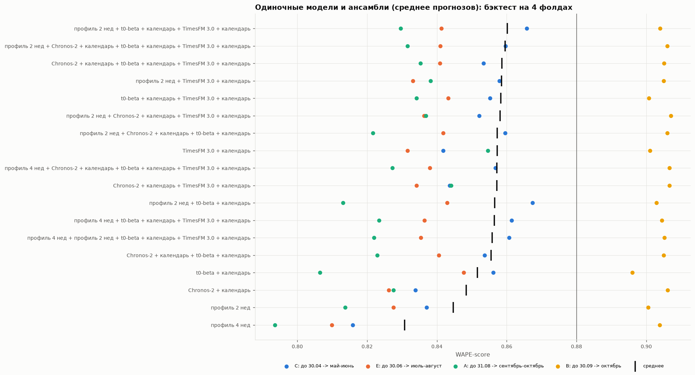

Дальше мы проверили, откуда берётся выигрыш. Прогноз каждой foundation-модели выровняли по уровню профиля: сумма маршрута за неделю как у профиля, от модели остаётся только форма внутри недели. После этого ни один ансамбль профиль не обыгрывает: лучший 0.843 против 0.845 ([tables/backtest_ensembles_level_aligned.csv](tables/backtest_ensembles_level_aligned.csv)). Значит, foundation-модели выигрывают только за счёт уровня. Они тянут прогноз к среднему по всей истории. На фолде A это помогло, потому что после летнего провала уровень рос. На ноябре-декабре то же свойство работает против нас. В будни от точки 31.10 прогноз Chronos-2 опускается с 0.96 до 0.89 октябрьского уровня к концу декабря, t0-beta с 0.93 до 0.85, у TimesFM уровень скачет от 0.81 до 0.97. Городская статистика прошлых лет говорит об обратном (п. 3.2).

### 4.6 Что не сработало

- LightGBM в обеих постановках: проигрывает профилю 1-3 п.п. в среднем.
- Профиль за 8 недель: хорош весной (0.855), но на переходах сезонов отстаёт на 5-6 п.п.
- Отдельный профиль для каждого дня Пн-Пт: разница с общим профилем будней меньше 0.1 п.п., будни и так ровные.
- Foundation-модели с выровненным уровнем: форма суток у них не лучше медианного профиля.
- Школьные каникулы как фактор: эффект на суточные суммы не отличим от нуля.
- TiRex-2 (Apache-2.0, лидер GIFT-Eval на часовых длинных горизонтах): запускали в Docker с GPU, за вызов он прогнозирует не больше 320 шагов, в среднем по фолдам 0.80, ниже seasonal naive и даже на первых 320 часах слабее остальных моделей. Отброшен вместе со скриптами (история в git до коммита, где он удалён).

### 4.7 Раунд 2: уровень, форма суток, зависимости

Скрипты [s14_profile_experiments.py](../../analysis/s14_profile_experiments.py) - [s18_city_level_backtest.py](../../analysis/s18_city_level_backtest.py), таблицы `tables/exp2_*.csv`. Раунд 1 показал, что главная ошибка в уровне, поэтому проверяли всё, что может его исправить, и то, что может стабилизировать форму суток.

**Разложение «уровень × форма» не помогло** ([tables/exp2_level_shape_pivot.csv](tables/exp2_level_shape_pivot.csv)). Форма суток по длинному окну хуже короткой: на октябре форма за 2-4 недели даёт 0.901, за 8 недель 0.892, за 12 недель 0.880. Уровень будней по дням недели (0.827), очистка истории от аномальных дней (0.831) и затухающий тренд (0.804-0.830) ухудшают профиль за 2 недели (0.845). Оптимальный множитель уровня показывает систематическое смещение: 0.93 и 0.92 на весенне-летних фолдах, 1.15 на переходе к осени, 1.03 на октябре.

**Форма суток зависит от светового дня, и зимняя похожа на октябрьскую.**

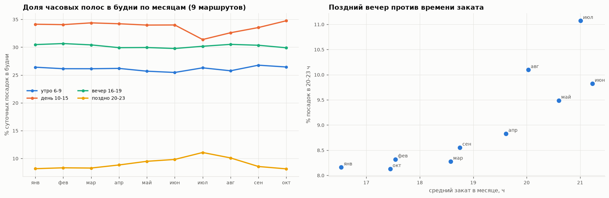

Доля позднего вечера (20-23 ч) в будни растёт вместе с закатом: 8.2-8.3 % в январе-феврале, 11.1 % в июле, 8.1 % в октябре. Форма суток января-марта отличается от октябрьской на 2.3-2.8 % посадок (L1-расстояние), почти как соседний сентябрь (2.0 %), а летняя на 4.8-6.1 %. Для ноября-декабря октябрьская форма подходит, дрейф в экспериментах выше шёл от переходов лето-осень.

**Дневные отклонения в основном свои у каждого маршрута.** После удаления локального уровня первая главная компонента остатков объясняет 38 % дисперсии, средняя корреляция между маршрутами 0.30, а погода объясняет 18 % общего фактора ([tables/daily_residual_common_factor.csv](tables/daily_residual_common_factor.csv)). Остальное - перекрытия и шум конкретного маршрута, внешними данными их не предсказать.

**Дождь бьёт по необязательным поездкам.** Час с осадками от 0.5 мм в будни снижает посадки днём (10-15 ч) на 5.8 % и поздно вечером на 7.0 %, а в пиковые часы только на 1.3-1.6 % ([tables/rain_effect_by_hour_band.csv](tables/rain_effect_by_hour_band.csv)). На метрике поправка по часовым полосам не лучше дневной: при известном уровне погода добавляет в среднем +0.04…+0.11 п.п. ([tables/exp2_weather_features.csv](tables/exp2_weather_features.csv)).

**Foundation-модели на дневных суммах лучше почасовых** ([s17_daily_fm.py](../../analysis/s17_daily_fm.py)). Горизонт становится 31-62 шага вместо 1464, прогноз суток раскладывается по часам долями профиля за 2 недели.

| Модель | C | E | A | B | Среднее | Почасовая версия |
|---|---|---|---|---|---|---|
| t0-beta, дневной | 0.868 | 0.829 | 0.861 | 0.903 | 0.865 | 0.852 |
| TimesFM 3.0, дневной | 0.867 | 0.813 | 0.859 | 0.904 | 0.861 | 0.857 |
| Chronos-2, дневной | 0.853 | 0.822 | 0.857 | 0.906 | 0.859 | 0.848 |
| Chronos-2 + t0-beta, дневные | 0.865 | 0.827 | 0.860 | 0.905 | 0.864 | |

От точки 31.10 уровень будней у дневных моделей в ноябре 0.94-1.03 от октябрьского, в декабре 0.90-0.99, у почасовых к концу декабря было 0.85-0.89.

**Городской сезонный уровень подтвердился на бэктесте** ([s18_city_level_backtest.py](../../analysis/s18_city_level_backtest.py)). Для каждого фолда профиль умножается на отношение «месяц прогноза / месяц отсечки» по трамваю Москвы из data.mos.ru, пересчитанное на эквивалент рабочего дня, с амплитудой 0.83 (п. 3.2). Это та же схема, что задаёт уровень ноября-декабря.

| Вариант | C | E | A | B | Среднее |
|---|---|---|---|---|---|
| профиль 2 нед | 0.837 | 0.828 | 0.814 | 0.901 | 0.845 |
| профиль × городской уровень | 0.859 | 0.849 | 0.840 | 0.902 | 0.862 |
| дневные Chronos-2 + t0-beta | 0.865 | 0.827 | 0.860 | 0.905 | 0.864 |
| **смесь пополам: профиль × городской уровень и дневные FM** | 0.869 | 0.844 | 0.860 | 0.905 | **0.869** |
| то же без подгонки амплитуды (1.0 вместо 0.83) | 0.871 | 0.845 | 0.857 | 0.905 | 0.870 |

Городские множители по фолдам 0.97/0.90, 0.91/0.92, 1.19/1.25 и 1.045 при оптимальных 0.93, 0.92, 1.15 и 1.03. Смещение профиля падает с -13…+9 % до -2…+7 %, у смеси до -0.4…+3.5 %. Результат не держится на подобранной амплитуде: с амплитудой 1.0 смесь даёт те же 0.870. Это прямое подтверждение эффекта внешнего источника data.mos.ru на метрике (критерий 2).

## 5. Прогноз на ноябрь-декабрь 2025

Финальный вариант - `final` ([s10_forecast.py](../../analysis/s10_forecast.py)): смесь, лучшая на бэктесте (0.869-0.870, п. 4.7), с маршрутом 5 и без погодной поправки, по итогам проб на лидерборде (п. 5.2). База - смесь пополам двух оценок. Первая: медианный профиль за 2 недели октября, умноженный на городской уровень ноября и декабря. Вторая: Chronos-2 и t0-beta на дневных суммах, разложенные по часам формой профиля. Поверх базы идут те же корректирующие коэффициенты событий, календаря и погоды. Вариант раунда 1 `external_all` (профиль за 4 недели × все коэффициенты) остаётся запасным. Каждый коэффициент - один внешний фактор с источником, все они собраны в `forecasts/coefficients_*.json`. В интерфейсе сервиса это будут ползунки (критерий 2в).

| Коэффициент | Значение | Основание |
|---|---|---|
| Уровень ноября / декабря к октябрю | 1.015 / 1.02 | data.mos.ru 62521 с поправкой на календарь и Т1, амплитуда 0.83 (п. 3.2) |
| Праздник в будни (03-04.11) | воскресный профиль × 0.95 | история праздников 2025 (п. 2.3) |
| Рабочая суббота 01.11 | профиль будня × 0.85 | сокращённый день перед тремя выходными; аналога в истории нет, оценка |
| 29-30.12 | профиль будня × 0.85 | экспертная оценка, аналога в истории нет |
| 31.12 | профиль праздника × 0.9, с 20:00 ноль | бесплатный проезд (mos.ru), проверено на 01.01.2025 |
| Выходные 7 и 50 с 15.11 | уровень будней октября × весеннее отношение выходных к будням, весенняя форма суток | пост Дептранса 15.11; до 15.11 остаётся октябрьский режим |
| Маршрут 7 с 12.11 | × 0.95 | запуск Т1 с общим участком; гипотеза, цифр нет |
| Маршрут 5 с 16.12 18:00 | около 5 тыс. в будни, форма суток маршрута 50 | запуск маршрута (Дептранс), 160 тыс. поездок за первый месяц; лидерборд подтвердил (+0.4 п.п.) |
| Погода | осадки -0.74 %/мм за день, -3.5 %/мм в час (до 3 мм), мороз -1.8 %/°C ниже -10; **в финале выключена** | п. 3.1, фактическая погода ноября-декабря 2025; на эталоне поправка дала -0.26 п.п. (п. 5.2) |

Файлы сабмитов лежат в `forecasts/`. Все в формате `route;date;hour;prediction`, по 14 640 строк, сетка сверена с шаблоном:

| Файл | Что внутри | Ноябрь, в сутки к октябрю | Декабрь |
|---|---|---|---|
| `submission_profile_only.csv` | профиль октября без внешних факторов | 0.934 | 0.979 |
| `submission_external_all.csv` | профиль 4 нед + все коэффициенты, маршрут 5 = 0 (основной раунда 1) | 0.941 | 0.989 |
| `submission_external_all_route5.csv` | то же + маршрут 5 с 16.12 | 0.941 | 0.998 |
| `submission_ensemble_external.csv` | профиль 2 нед + почасовые Chronos-2 и t0, те же события | 0.905 | 0.928 |
| `submission_daily_fm_external.csv` | дневные Chronos-2 + t0 × форма профиля, уровень моделей, те же события | 0.910 | 0.937 |
| `submission_blend_external.csv` | смесь: профиль × городской уровень и дневные FM, те же события | 0.924 | 0.961 |
| `submission_blend_external_route5.csv` | то же + маршрут 5 с 16.12 (лидерборд 0.89574) | 0.924 | 0.971 |
| **`submission_final.csv`** | **то же без погодной поправки (финальный, по итогам проб на лидерборде)** | **0.935** | **0.982** |
| `submission_ensemble_timesfm_external_NONCOMMERCIAL.csv` | с TimesFM 3.0, только для сравнения | 0.897 | 0.905 |

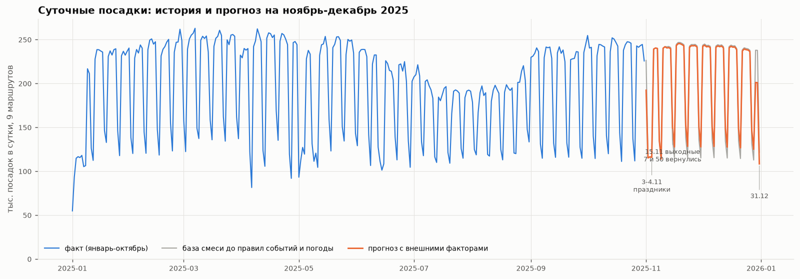

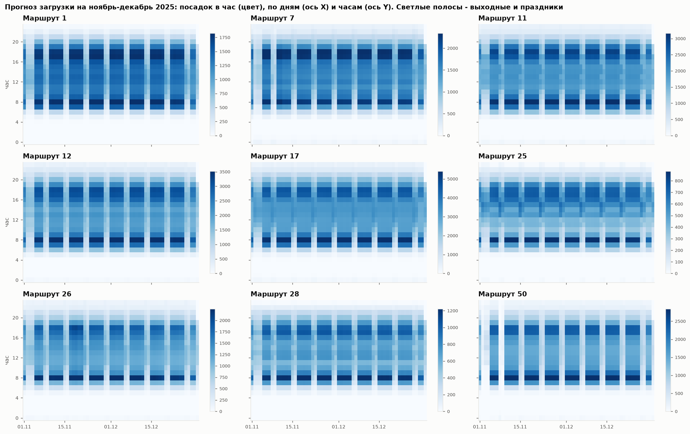

Тепловая карта - это то, что увидит диспетчер: по каждому маршруту час суток × день горизонта. У маршрута 50 выходные до 15.11 пустые, дальше восстанавливаются. 31.12 после 20:00 обнуляется.

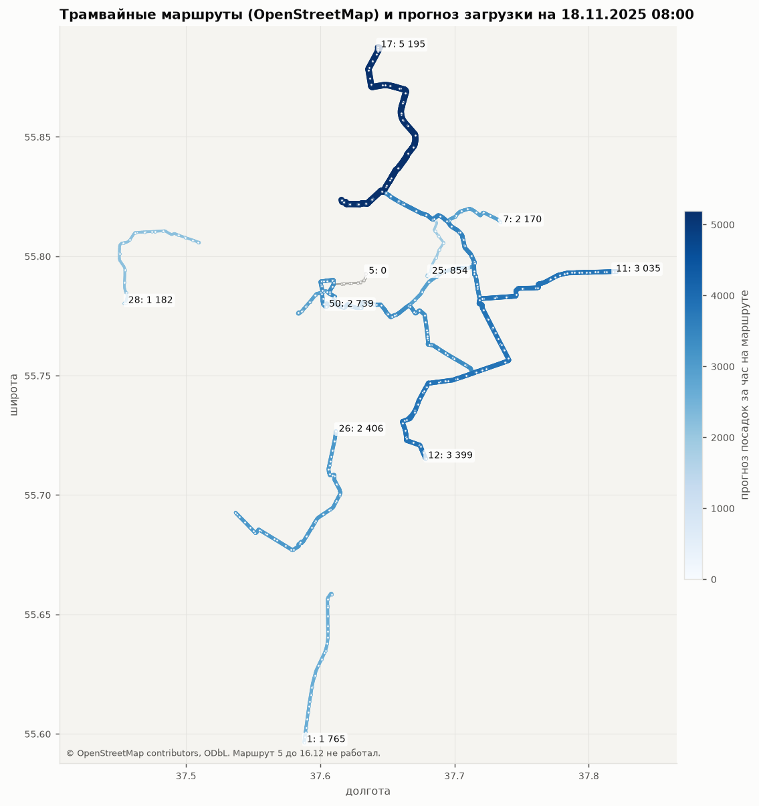

Посадки в данных не привязаны к остановкам, поэтому на карте загрузка показана на уровне маршрута: цвет и толщина линии - прогноз посадок за час. Трассы и остановки взяты из OpenStreetMap для всех 10 маршрутов. Разложить посадки по остановкам можно будет, если появятся данные о положении вагона (телематика) или межостановочные корреспонденции.

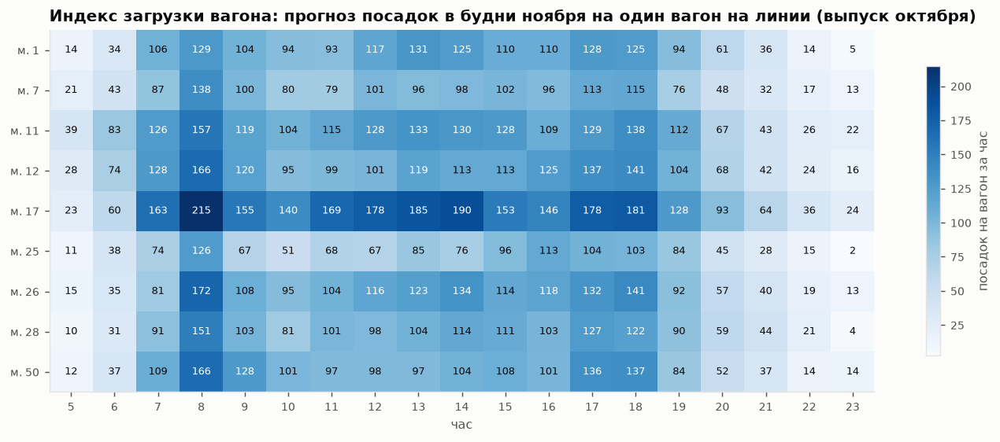

Индекс загрузки вагона делит прогноз посадок на число вагонов, которые работали на линии в тот же час в будни октября. Самые напряжённые места: маршрут 17 в 8 утра (218 посадок на вагон за час), в 12-14 и 17-18 ч (182-190). Дальше идут 26-й, 12-й, 50-й и 28-й в 8 утра (164-174). Для диспетчера это список «куда добавить выпуск в первую очередь».

### 5.1 Как проверить уровень и факторы на лидерборде

В день доступно 24 успешных загрузки, этого хватает, чтобы проверить факторы на реальном эталоне. Предлагаем порядок:

1. `profile_only` против `blend_external`. Разница показывает суммарный эффект внешних факторов, это прямое подтверждение для критерия 2.
2. `blend_external` против `blend_external_route5`. Вопрос «есть ли маршрут 5 в эталоне» решается одной парой загрузок.
3. `blend_external`, умноженный на 0.97 и на 1.03. WAPE-score кусочно-линеен по множителю, три точки показывают, в какую сторону сдвинут уровень.
4. `blend_external` против `external_all` и `daily_fm_external`. Три варианта отличаются в основном уровнем (0.910-0.941 в ноябре к октябрю в сутки), пара загрузок покажет, чья оценка уровня ближе к эталону.

### 5.2 Результаты на лидерборде

Список загрузок на платформе показывает сначала новые: у двух загрузок в 14:08 первой была нижняя строка.

| Дата | Файл | WAPE-score | Вывод |
|---|---|---|---|
| 25.09.2026 14:08 | `probes/p01_main.csv` (= `submission_blend_external.csv`) | 0.89169 | выше порога 0.88, максимум баллов по критерию 1 |
| 25.09.2026 14:08 | `probes/p02_route5.csv` (= `submission_blend_external_route5.csv`) | **0.89574** | посадки маршрута 5 с 16.12 улучшают скор на 0.4 п.п. |
| 25.09.2026 14:12 | `probes/p07_no_weekend_restore.csv` | 0.88011 | без возврата выходных маршрутов 7 и 50 с 15.11 скор ниже на 1.16 п.п. |
| 25.09.2026 14:21 | `probes/p08_no_weather.csv` | 0.89431 | без погодной поправки скор **выше** на 0.26 п.п. |
| 25.09.2026 14:21 | `probes/p09_no_calendar_rules.csv` | 0.89026 | без правил 01.11, 29-31.12 и нуля после 20:00 31.12 скор ниже на 0.14 п.п. |
| 25.09.2026 15:06 | `submission_ex_ante.csv` ([s30](../../analysis/s30_ex_ante.py)) | 0.89541 | честный прогноз от 31.10 без foundation-моделей, на 0.11 п.п. выше `p08` |
| 25.09.2026 | `submission_ex_ante_route5.csv` ([s32](../../analysis/s32_ex_ante_route5.py)) | **0.89950** | лучший результат: честный вариант + маршрут 5, как и ожидалось (+0.41 п.п. к `submission_ex_ante.csv`) |

Что следует из первых двух загрузок. Вариант с маршрутом 5 отличается только строками маршрута 5 (+63 тыс. посадок), поэтому вся разница скоров приходится на них. Из WAPE основного варианта (0.108) следует, что сумма эталона лежит между 11.1 и 13.8 млн, тогда ошибка уменьшилась на 45-56 тыс. Добавка прогноза p меняет ошибку на Σp - 2·Σmin(эталон, p), значит, с эталоном совпало 54-60 тыс. из 63 тыс., то есть 85-94 % прогноза по маршруту 5. Маршрут в эталоне есть, и его объём мы оценили почти точно по внешней новости. Это ещё одно подтверждение внешнего источника «события сети» на настоящем эталоне.

Проба `p07` отличается от `p01_main` только выходными маршрутов 7 и 50 с 15.11: 665 строк, 203 тыс. посадок. Эту поправку мы взяли из поста Дептранса о восстановлении движения (п. 3, `external/events_2025.csv`), в данных её не было: в сентябре-октябре маршрут 50 по выходным не ходил. Без неё ошибка растёт на 128-159 тыс. посадок, и тем же расчётом выходит, что 82-89 % добавки совпали с эталоном. Это самый крупный из проверенных внешних факторов, и его эффект подтверждён на настоящем эталоне.

Пробы `p08` и `p09` тоже построены на основе без маршрута 5 и сравниваются с `p01_main` (0.89169). В минуту 14:21 загрузка `p08` была первой, поэтому в списке платформы она стоит ниже `p09`.

Календарные правила подтвердились (+0.14 п.п.), а погодная поправка на эталоне вредит (-0.26 п.п.). Это согласуется с бэктестом: там погода помогала только когда уровень был завышен, а в среднем давала около +0.1 п.п. (п. 3.1, 4.7). Эффект погоды на посадки реален и значим в регрессии: -0.74 % на мм осадков, p < 0.001. Но для ноября-декабря 2025 года поправка получилась больше, чем нужно: ноябрь был дождливым (143 % нормы), и поправка сняла 146 тыс. посадок. Поэтому в финальном сабмите погоды нет, а в сервисе она остаётся ползунком с коэффициентом по умолчанию 0.

Финальный сабмит `forecasts/submission_final.csv` (вариант `final` в s10) = `p08` + маршрут 5: смесь, возврат выходных 7 и 50, Т1, календарные правила, маршрут 5 с 16.12, без погодной поправки. От `p08` он отличается только 312 строками маршрута 5, поэтому ожидаемый скор около 0.894 + 0.004 ≈ 0.898.

Загрузка `submission_ex_ante.csv` проверяет границу информации. Её собирает [s30](../../analysis/s30_ex_ante.py) только из того, что было известно 31.10: профиль за 2 недели без foundation-моделей, уровень ноября и декабря по городскому трамваю 2019 и 2022-2024 (1.003 и 1.034 к октябрю), календарь, ноль после 20:00 31.12 и возврат выходных 7 и 50 с 15.11. Возврат обоснован постом ЦОДД от 31.10 о конце работ в Протопоповском переулке 10.11 ([t.me/DtOperativno/23364](https://t.me/DtOperativno/23364)), из-за этого ремонта выходные и закрывали. Т1, маршрут 5 и погода выключены. Скор 0.89541 на 0.11 п.п. выше `p08`, который тоже без маршрута 5 и погоды, но берёт уровень 2025 года и foundation-модели. До лучшего результата не хватает только маршрута 5, дату запуска которого 31.10 не знали. Качество прогноза держится на данных, доступных в момент прогноза: постфактум-факты добавляют к нему 0.03 п.п.

Организаторы 25.09.2026 ответили: скор на лидерборде считается по всему ноябрю-декабрю, скрытой части нет; в зачёт идёт лучший результат за все дни; внешние данные, опубликованные после 31.10.2025 (фактическая погода, новости Дептранса и т. п.), использовать можно. Поэтому лидерборд и есть итоговая метрика, а факты после 31.10 можно брать в финал. Кандидат `forecasts/submission_ex_ante_route5.csv` ([s32](../../analysis/s32_ex_ante_route5.py)) = честный вариант s30 + маршрут 5 с 16.12. От `submission_ex_ante.csv` он отличается только 312 строками маршрута 5 (+64 тыс. посадок), ожидаемый скор около 0.8954 + 0.004 ≈ 0.899, на лидерборде 0.89950.

Пробы уровня (`p03`-`p06`) баллов уже не добавят: шкала критерия 1 выше 0.88 не растёт. Они имеют смысл, только если важна позиция в таблице лидеров.

## 6. Область применимости и ограничения

Где модель валидна:

- маршруты с историей не короче 4 недель в стабильном режиме, без перекрытий в последнем месяце;
- горизонт до двух месяцев от точки отсечки. Дальше нужен уровень из внешней сезонности: на бэктесте переход через смену сезона стоит 6-7 п.п.;
- дни, тип которых встречался в истории: будни, выходные, праздники. Рабочая суббота, 29-31.12 и новогодняя ночь задаются правилами.

От каких внешних данных зависит:

- производственный календарь на год прогноза (isdayoff.ru, постановление Правительства);
- помесячная статистика data.mos.ru, чтобы задать уровень на новые месяцы;
- план перекрытий и запусков маршрутов (Дептранс). Без него модель не узнает о закрытии участка;
- прогноз погоды на горизонт. В бэктесте и сабмите использована фактическая погода, в реальной эксплуатации её заменит прогноз, и эффект погоды будет немного слабее.

Как перенести на новый маршрут: нужны 4 недели валидаций в обычном режиме. Для нового маршрута без истории (как маршрут 5) профиль берётся с похожего маршрута, а уровень из официальных цифр запуска.

Ограничения:

- Посадки без привязки к остановке и без выхода пассажира: загрузку по перегонам из этих данных не восстановить.
- Будущие перекрытия непредсказуемы по истории, прогноз хорош ровно настолько, насколько полон план работ.
- Коэффициенты рабочей субботы, 29-30.12 и Т1 не проверены на данных. Их надо проверять на лидерборде или по фактам.
- Если эталон собирали по `place_id`, а не по маршрутам, закрытие депо им. Баумана 27.12 могло убрать из него часть посадок маршрутов 50 и 12. Проверить это нельзя.

## 7. Как воспроизвести

```bash
uv sync                      # базовый анализ
uv sync --extra fm           # + torch cu130, chronos-forecasting, timesfm, tfc-t0

cd analysis
uv run python s00_prepare_parquet.py      # CSV -> data/validations.parquet (~2 мин)
uv run python s01_fetch_weather.py        # погода Open-Meteo -> external/
uv run python s02_target_structure.py     # рис. 01-05
uv run python s03_raw_quality.py          # качество, сверка labels, агрегаты
uv run python s04_supply_and_passengers.py  # рис. 06-08
uv run python s05_weather_effect.py       # рис. 09
uv run python s06_backtest.py             # рис. 10-11, классические модели
uv run python s07_foundation_models.py Chronos-2
uv run python s07_foundation_models.py t0-beta
uv run python s07_foundation_models.py "TimesFM 3.0"
uv run python s08_fetch_external.py       # data.mos.ru, isdayoff, световой день, OSM
uv run python s09_external_factors.py     # рис. 12-13
uv run python s10_forecast.py             # forecasts/*.csv и коэффициенты
uv run python s11_ensembles.py            # рис. 17
uv run python s12_forecast_viz.py         # рис. 14-16, 18
# раунд 2
uv run python s14_profile_experiments.py  # уровень × форма, очистка, тренд, оптимальный множитель
uv run python s15_dependencies.py         # рис. 19: дрейф формы, общий фактор, дождь по часам
uv run python s16_weather_features.py     # погодные поправки v2
uv run python s17_daily_fm.py             # foundation-модели на дневных суммах
uv run python s18_city_level_backtest.py  # городской уровень на бэктесте
# внешние источники
uv run python s33_fetch_traffic.py        # загруженность дорог: data.mos.ru 62525 и баллы ЦОДД -> external/
uv run python s34_traffic_probe.py        # рис. 20: эффект трафика и бэктест уровня по трафику
uv run python s35_traffic_forecast.py     # forecasts/submission_traffic.csv
```

Среда: Windows 11, Python 3.13, uv 0.12.15, DuckDB 1.5.5, pandas 3.0.6, LightGBM 4.7.0, torch 2.14.0+cu130, RTX 5070 12 ГБ, Ryzen 5 5600X, 32 ГБ RAM. Сырые CSV (10.4 ГБ) в репозиторий не входят, `data/` с parquet и кэшами тоже.
