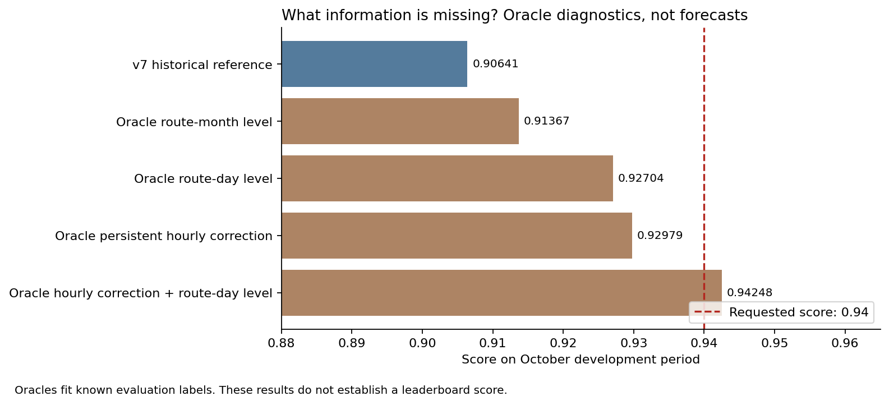

# Исследование пути к 0.94 после v9

Дата: 26.09.2026. Подтверждённый лучший результат остаётся **v7 = 0.90570**.
v8 = 0.90555, v9 = 0.90543. В этой работе новый конкурсный CSV не создавался.
Найдены и проверены новые внешние наблюдения, выполнены диагностика ошибки
и два семейства экспериментов с парковками. **Решение с доказанным 0.94 пока не получено.**

## 1. Какого размера обновление действительно нужно

Для `score = 1 − sum(abs(y−p))/sum(y)` переход 0.90570 → 0.94 означает
снижение оставшейся абсолютной ошибки на **36.37%**.
По прежней пробе p10 общий таргет оценивается в 12 882 777 посадок:
ошибка должна уменьшиться примерно с **1 214 846 до 772 967**, на **441 879**.
Оценка суммы предполагает нулевой маршрут 5 в ноябре и имеет погрешность
из-за округления платформенного скора; относительные 36.37% от этого не зависят.

Неравенство треугольника даёт проверку без скрытых ответов:

`score(q) ≤ score(v7) + sum(abs(q−v7))/sum(y)`.

| Файл | Абсолютное изменение относительно v7 | Оптимистическая верхняя граница скора |
|---|---:|---:|
| v8 | 233 100 | 0.92379 |
| v9 | 320 357 | 0.93057 |

То есть эти **конкретные файлы**, даже при безошибочном направлении каждой
поправки, не могли достичь 0.94. Это не предел их архитектур и не причина
произвольно увеличивать коэффициенты: достаточный размер изменения ещё
не означает правильное направление. Обычная выпуклая смесь v7/v8/v9
также не обходит эту границу.

Расчёт воспроизводится `analysis/s77_research_error_budget.py`, таблицы:
[budget.json](../analysis/tables/research_094/budget.json),
[расстояния всех 17 оценённых файлов](../analysis/tables/research_094/submission_distance_bounds.csv).

## 2. Где должен появиться недостающий сигнал

На исторических фолдах я подогнал отдельные группы поправок **по самим
проверочным ответам**. Это диагностические оракулы, а не качество моделей.
Каждый множитель оптимален по L1 внутри своей группы; нули исходного
прогноза остаются нулями. Сложные варианты чередуют оптимизацию дневных
множителей и устойчивого профиля часов восемь раз; глобальная оптимальность
их совместной подгонки не утверждается.

| Что стало идеально известно на октябре | Диагностический скор |
|---|---:|
| Ничего нового: историческое ядро v7 | 0.90641 |
| Множитель маршрута за месяц | 0.91367 |
| Множитель маршрута × месяца × типа дня | 0.91612 |
| Множитель каждого маршрутного дня | 0.92704 |
| Постоянная поправка маршрута × месяца × типа дня × часа | 0.92979 |
| Эта поправка формы + уровень сети на каждый день | 0.93190 |
| Эта поправка формы + уровень каждого маршрутного дня | **0.94248** |

Вывод: одного правильного месячного уровня, даже разбитого по маршрутам,
для желаемого скачка недостаточно. Перспективна совместная реконструкция
**суточной формы и ежедневных отклонений конкретного маршрута**. Последняя
строка требует знания ответов и не подтверждает достижимость такой точности
без них. Ранее упоминавшиеся 0.92 тоже не являются теоретическим потолком.

На октябре маршруты **11, 17, 12, 50, 7** дают 71.18% абсолютной ошибки.
При этом №11 даёт больше ошибки, чем №17. Часы 16–19 дают около 30.89%.
Исправление одного худшего дня целиком дало бы только +0.00467;
трёх худших — +0.01316. Поэтому поиск одной аварии не обоснование для +0.0343.
Это структура **октябрьской проверки**, перенос на ноябрь–декабрь не доказан.

[Все шесть периодов](../analysis/tables/research_094/historical_oracles.csv),
[маршруты, часы и дни](../analysis/tables/research_094/error_concentration.csv).
Периоды пересекаются и ранее многократно использовались для разработки.



## 3. Новые материалы соревнований и что из них переносится

Предыдущий [обзор Kaggle](kaggle_transfer_2026-09-25.md) уже включает Recruit,
Rossmann, M5, ASHRAE, Rohlik и Web Traffic. Их окна истории, календарь,
LightGBM, дневная декомпозиция и ансамбли во многом уже проверены у нас.
Повторный перечень этих методов не считается новым улучшением.

### KDD Cup 2017: победитель прогноза количества автомобилей

Место команды Convolution подтверждено [организаторами](https://www.kdd.org/kdd2017/announcements/view/announcing-kdd-cup-2017-highway-tollgates-traffic-flow-prediction).
Прочитана [авторская презентация Volume Prediction, 24 страницы](https://www.kdd.org/kdd2017/files/Task2_1stPlace.pdf).
Малое число рядов и шумные счётчики близки нашей задаче. Авторы объединяли
простые модели, статистики нескольких временных окон и разных направлений,
а также обновляли модели по мере появления доступных наблюдений тестового
периода. Важнейшее различие: у них часть наблюдений внутри этого периода
выдавалась. У нас за ноябрь–декабрь таких валидаций нет.

**Перенос:** искать наблюдения целевого периода и условно восстанавливать
поток по ним. Масштабные веса малых значений из чужой метрики не копировать:
наша глобальная абсолютная ошибка сильнее зависит от больших потоков.
Для нас релевантнее пополнить информацию, чем воспроизводить весь ансамбль.

### Traffic4cast 2022: первое и второе места

[Официальный итог и ссылки на код](https://github.com/iarai/NeurIPS2022-traffic4cast).
Победитель использовал восстановление отсутствующих счётчиков через TVAE,
признаки сети и графовое внимание; см. [статью авторов](https://arxiv.org/abs/2211.00641).
Второе место — сжатие наблюдений счётчиков через PCA и LightGBM;
[статья](https://arxiv.org/abs/2211.00157), [код](https://github.com/skandium/t4c22),
[разбор автора](https://mlumiste.com/technical/gradient-boosting-neurips/).

Здесь прогнозировали на 15 минут по наблюдениям предшествующего часа.
**Наш перенос — связь между двумя источниками городских наблюдений**:
парковки/телематика → остаточная ошибка трамвайного потока. Копирование GAT
без внешних счётчиков не воспроизводит условия победителя.

### ASHRAE: очистка датчиков и разрешённые внешние наблюдения

В [архиве организаторов с пятью лучшими решениями](https://github.com/buds-lab/ashrae-great-energy-predictor-3-solution-analysis)
описаны удаление аномальных постоянных/нулевых серий и применение внешних
наблюдений при обучении или подборе ансамбля. Это полезно при работе
с новым архивом датчиков. Из этого не следует, что любой чужой счётчик
совпадает с нашим таргетом. Проверять совпадение объекта, времени и определения
показателя нужно до использования его как ответа.

### Web Traffic: устойчивость результата важнее размера сети

Повторно прочитан [разбор победителя](https://github.com/Arturus/kaggle-web-traffic/blob/master/how_it_works.md).
Автор использовал календарь, сезонные лаги и усреднение разных состояний
и запусков модели. В его экспериментах явные лаги могли обходиться без сложного
attention. Для нас годовых лагов маршрутов нет, а усреднение трёх seed уже
делалось. Следующий Transformer на тех же данных не закрывает этот дефицит.

### Rohlik и обобщающий обзор

[Победитель Rohlik Sales](https://www.kaggle.com/competitions/rohlik-sales-forecasting-challenge-v2/writeups/golden-1st-place-solution)
выделил отдельные горизонты и признаки доступности конкурирующих товаров.
Аналог у нас — действующие соседние маршруты, их интервалы и участки
пересечения, особенно после Т1. Это гипотеза переноса; эффект конкретного
маршрута нельзя взять из продуктового соревнования.

[Ближайший по горизонту Rohlik Orders](https://www.kaggle.com/competitions/rohlik-orders-forecasting-challenge)
ставил 60-дневную задачу; прочитан [разбор второго места](https://www.kaggle.com/competitions/rohlik-orders-forecasting-challenge/writeups/techniquetwice-2nd-place-solution-single-lgbm-mode).
Он подтверждает полезность календарных деталей, но это уже реализованное
направление. Не приписываем ему новые результаты нашей модели.

Для общей картины прочитан [обзор шести Kaggle-соревнований в IJF](https://doi.org/10.1016/j.ijforecast.2020.07.007).
Применимость методов зависит от частоты, горизонта и внешней информации;
число слоя в сети не является универсальным объяснением качества.

## 4. Новый открытый архив: парковки за наши целевые даты

Найден [Moscow Parking Occupancy Dataset](https://github.com/matrosovcmtn/moscow-parking-occupancy).
Автор/составитель — Danil Matrosov / ParkOut; исходные наблюдения — публичные
данные парковок Департамента транспорта Москвы; лицензия **CC BY 4.0**.
Есть [зеркало Kaggle](https://www.kaggle.com/datasets/danilmatrosov/moscow-parking-occupancy).
Загрузка закреплена на commit `5e7ca2096959f2557c0f05714bb534a2f5bdde6c`.
Скачано 13 файлов, **5 566 569 байт**, чужой код не запускался.

Проверка самих файлов, после перевода UTC → Москва:

| Месяц | Наблюдения | Парковки | Часы с хотя бы одним наблюдением |
|---|---:|---:|---:|
| Ноябрь 2025 | 253 871 | 177 | 720 из 720 |
| Декабрь 2025 | 265 854 | 195 | 744 из 744 |

Полнота по часам сети не означает полноту каждой парковки. В сентябре
наблюдения есть в 624 часах из 720, в октябре — в 660 из 744. Отрицательные
проценты, постоянные датчики и изменения состава парковок требуют обработки.
Текущие `feed_silent` и `last_free_at` из справочника 2026 года не использованы
для фильтрации 2025. Метаданные координат текущие: их историческая неизменность
отдельно не подтверждена.

Исходники лежат локально в `data/research_094/parking/`; SHA-256 каждого файла
в `manifest.json`. В рабочую копию репозитория добавлены код загрузки и отчёт;
сырой архив сохранён локально в игнорируемой папке `data/`.
Производные признаки — часовые медианы, отклонения от обычного профиля,
изменения за 1/3 часа, PCA и показатели восьми ближайших парковок к остановкам
каждого маршрута. Ближайшие датчики к большинству маршрутов находятся
в сотнях метров; близость не доказывает связь их пользователей с трамваем.

### Что дали реальные проверки

Обучены восемь LightGBM-корректоров: с парковками/без парковок на четырёх
периодах. Все настройки одинаковы. Обучающие остатки взяты из исторических
прогнозов v7, при пересечении дат оставлен более свежий прогноз; перед
проверочным периодом отсекаются все последующие метки. Поэтому оценивается
добавочная информация парковок, а не просто дополнительный бустинг.

| Период | Прирост к v7, корректор без парковок, вес 25% | С парковками, вес 25% |
|---|---:|---:|
| R06 | +0.000731 | +0.001578 |
| R07 | −0.000887 | −0.003616 |
| R08 | −0.000051 | −0.001653 |
| Октябрь B | +0.000435 | +0.000805 |

Увеличение веса не решает проблему. Если сохранять дневные суммы и менять
только форму, парковки дают на октябре +0.000903 и на R08 +0.000974,
но ухудшают два других периода. Таблицы:
[общая поправка](../analysis/tables/research_094/parking_ablation.csv),
[разделение уровня и формы](../analysis/tables/research_094/parking_components.csv).

Дополнительно проверена совместная линейная модель остатков маршрутов
через 2/6 скрытых факторов PLS. Перед ней вычитается обычный профиль
парковок внутри месяца; здесь разрешённые наблюдения внешнего источника
используются за весь месяц. Метки трамваев проверочного периода не используются.
Результат также нестабилен: rank=2, вес 25% даёт на R07 +0.001575,
но на R06 −0.002367 и на октябре −0.000208. [Все варианты](../analysis/tables/research_094/parking_factor_ablation.csv).

**Решение:** источник сохранить; найденный датасет не объявлять готовым
улучшением. По двум проверенным семействам нет оснований тратить сабмит
или обещать +0.0343. Это полезный отрицательный результат исследования.

## 5. Самые сильные следующие направления

1. **Фактическая телематика из соседнего трека этого же хакатона.**
   На [официальном сайте](https://mt-hackathon.ru/) для «Предиктора изменений
   в графике движения» заявлены NDTP и эталонное расписание. Если датасет
   включает ноябрь–декабрь 2025 и наши маршруты, из него можно получить
   число реально работавших вагонов, интервалы и простои. Ссылка на файлы
   в открытой странице не найдена; запросили у пользователя ссылку из кабинета.
   Даты и покрытие пока **не подтверждены**. Наличие такого трека само по себе
   не доказывает наличие нужных месяцев.

2. **Совместная модель работы маршрута и спроса.**
   При наличии телематики: отдельный прогноз рейсов/вагоно-часов и посадок
   на единицу работы, затем часовой профиль и поправка по соседним линиям.
   Например, простои уменьшают выполненную работу, а праздничный спад
   уменьшает поток на работающий вагон. Проверить абляции «без/с фактическим
   выпуском» и «без/с соседними маршрутами», отдельно 11/12/17 и 7/50.
   Число вагонов с валидациями из нашего сырья — зависимый от таргета proxy,
   его нельзя выдавать за независимо измеренный выпуск. В текущей рабочей
   копии `data/validations.parquet` отсутствует; исходный анализ s04 имеется,
   но новые результаты по составу пассажиров здесь не рассчитывались.

3. **Узкая информация с лидерборда о форме часов, а не очередной общий blend.**
   При разрешённых пробах использовать малое число заранее заданных групп:
   рабочие 7–10, 11–15, 16–19, 20–23 по крупным маршрутам, отдельно месяцы.
   Уже имеющиеся пробы дают суммы, которые почти совпадают с v6; они не
   сообщают, в какие часы ошибается модель. Нужна оценка информативности
   и расхода лимита до подготовки новых проб. Суммарный ответ не восстанавливает
   тысячи отдельных ячеек; метод не гарантирует 0.94. Неоценённые p13/d01–d05
   не считаются наблюдениями.

4. **Ноябрь–декабрь как отдельные режимы, включая Т1 и вечерние пики.**
   Учить перенос формы по зимним аналогам и типам пассажиров, а не только
   менять общий уровень. Микроданные тарифных групп могут дать отдельные
   ряды учащихся/постоянных/нерегулярных пассажиров; пока это не обученная
   модель и не подтверждённый прирост. Геометрия соседних маршрутов даёт
   признаки пересечения, но не фактическое перераспределение пассажиров.

Открытый [GTFS Москвы](https://mobilitydatabase.org/feeds/gtfs/mdb-3226)
в просмотренной истории содержит выгрузку июня 2026, не подтверждённый
архив расписаний конца 2025. Годовые отчёты транспорта найдены в каталоге,
но загрузка страниц завершилась timeout; точных годовых/ноябрьских итогов
по нашим маршрутам из них не извлечено. Отсутствие найденного результата
не доказывает отсутствия данных вообще.

## 6. Воспроизведение

```bash
.venv/bin/python analysis/fetch_parking_archive.py
export PYTHONPATH=analysis
export MPLCONFIGDIR=/tmp/metro-matplotlib
export DYLD_LIBRARY_PATH="$PWD/.venv/lib/python3.9/site-packages/sklearn/.dylibs"
.venv/bin/python analysis/s77_research_error_budget.py
.venv/bin/python analysis/s78_parking_signal_research.py
.venv/bin/python analysis/s79_parking_factors.py
```

Нужны уже сохранённые кэши v7 и `data/neural_training_pack/`.
Первое чтение парковок создаёт часовой кэш; после смены исходного commit
или способа очистки его нужно удалить. Все 17 оценённых прогнозов проверены
по хешам; новых загрузок на платформу в этом исследовании нет.
